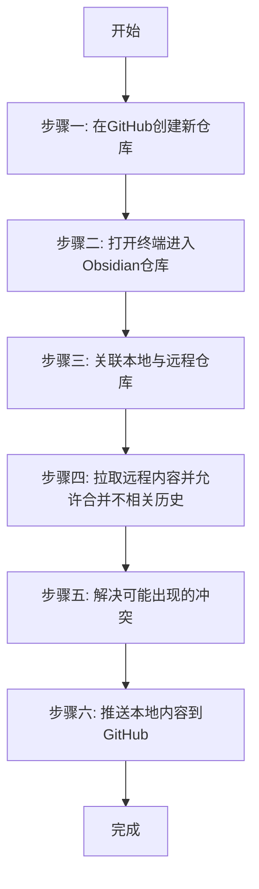

# DeepSeek对话 - Git branch diverged resolution

> 统计信息：累计Token用量 97316
> 生成时间：2026/3/10 11:14:42

## Assistant
*2026-03-01_08:42:28*

This message indicates that your local `main` branch and the remote `origin/main` branch have diverged - they each have commits that the other doesn't have. Here's what this means:

- Your local branch has 2 commits that aren't on the remote
- The remote branch has 1 commit that isn't on your local branch

## Options to resolve this:

### 1. **Merge the remote changes** (preserves both branches' history)
```bash
git pull origin main
```
This will fetch the remote commit and merge it with your local commits, creating a merge commit.

### 2. **Rebase your changes** (cleaner linear history)
```bash
git pull --rebase origin main
```
This will temporarily remove your 2 commits, pull the remote commit, then reapply your commits on top.

### 3. **Force push your changes** (if you're sure you want to overwrite remote)
```bash
git push --force origin main
```
⚠️ **Be careful**: This will discard the remote commit and replace it with your local branch. Only do this if:
- You're working alone on this branch
- You're certain you don't need the remote commit
- You've coordinated with your team

### 4. **Inspect the differences first**
To see what's different:
```bash
git log origin/main..main     # Your local commits not on remote
git log main..origin/main     # Remote commits not on local
```

Which approach is best depends on whether you need to keep the remote commit and your team's workflow.

---

## Assistant
*2026-03-01_08:46:55*

This error occurs because Git is refusing to merge two branches that don't share a common commit history. This typically happens when:

- The repository was initialized separately and then connected to a remote
- Branches were created with different starting points
- The remote repository was created with an initial commit (like a README) that your local repo doesn't have

## Solutions:

### Option 1: Allow unrelated histories (recommended)
```bash
git pull origin main --allow-unrelated-histories
```

This tells Git to merge the two branches despite their different histories. After running this:
- Git will attempt to merge the branches
- You may need to resolve any conflicts
- Then commit the merge

### Option 2: Rebase with unrelated histories flag
```bash
git pull --rebase origin main --allow-unrelated-histories
```

### Option 3: If you want to overwrite remote with your local (use with caution)
```bash
git push --force origin main
```
⚠️ This will completely replace the remote branch with your local version, discarding any remote commits.

## What likely happened:
It seems your remote repository might have been initialized with a default branch (often containing a README,.gitignore, or LICENSE file) while your local repository was initialized separately, creating two unrelated Git histories.

## Next steps:

1. **Check what's on the remote** (to make an informed decision):
```bash
git fetch origin
git log origin/main --oneline
```

2. **If you want to keep both histories**, use:
```bash
git pull origin main --allow-unrelated-histories
```

3. **After pulling**, if there are conflicts, resolve them, then:
```bash
git add.
git commit -m "Merge unrelated histories"
git push origin main
```

This should resolve the divergence and get your branch back in sync with the remote.

---

## Assistant
*2026-03-01_08:54:27*

根据你之前遇到的" refusing to merge unrelated histories"错误，你的本地Git仓库和GitHub远程仓库已经有了各自独立的历史。下面我将为你提供一套完整的、安全的操作步骤，将你的Obsidian仓库提交到GitHub。

## 📋 整体操作流程概览



## 🔧 详细操作步骤

### 步骤一：在GitHub上创建一个新仓库

1. 登录你的GitHub账号，点击右上角的"+"号，选择"New repository"[citation:1]
2. 输入仓库名称（例如：`my-obsidian-vault`）
3. **重要：不要勾选**"Initialize this repository with a README"选项
4. 点击"Create repository"完成创建
5. 创建后，复制仓库的URL（HTTPS或SSH格式均可）

### 步骤二：进入你的Obsidian本地仓库

打开终端（Git Bash或命令行），进入你的Obsidian仓库目录：
```bash
cd /你的Obsidian仓库路径
```

### 步骤三：关联本地仓库与GitHub远程仓库

```bash
# 查看当前远程仓库连接情况
git remote -v

# 如果还没有远程仓库，添加远程仓库地址
git remote add origin https://github.com/你的用户名/仓库名.git

# 如果已经有远程仓库但地址不对，先删除再添加
git remote rm origin
git remote add origin https://github.com/你的用户名/仓库名.git
```

### 步骤四：拉取远程内容并允许合并不相关历史

这是解决你之前遇到错误的关键步骤[citation:7]：
```bash
# 使用--allow-unrelated-histories参数拉取远程内容并合并
git pull origin main --allow-unrelated-histories
```
如果你的默认分支是`master`而不是`main`，请将上面的`main`替换为`master`。

### 步骤五：处理可能出现的冲突

在执行完上一步后，可能会出现合并冲突：
1. Git会提示哪些文件有冲突
2. 打开这些文件，查找`<<<<<<<`、`=======`、`>>>>>>>`标记
3. 手动编辑文件，保留你想要的内容
4. 保存文件后，执行以下命令：
```bash
git add.
git commit -m "解决合并冲突"
```

### 步骤六：将本地内容推送到GitHub

```bash
# 将本地main/master分支推送到远程仓库
git push -u origin main
```
`-u`参数会建立本地分支与远程分支的追踪关系，以后只需执行`git push`即可[citation:3][citation:6]。

## ⚠️ 重要注意事项

1. **备份你的Obsidian仓库**：在进行这些操作前，建议先备份你的Obsidian文件夹
2. **敏感信息处理**：确保你的笔记中没有密码、密钥等敏感信息
3. **.gitignore配置**：建议创建`.gitignore`文件，排除不需要上传的文件：
   ```.obsidian/workspace.obsidian/cache.trash/
   ```

4. **如果不小心在GitHub创建了带README的仓库**：仍然可以使用`--allow-unrelated-histories`参数解决[citation:7]

## ✅ 验证结果

操作完成后，刷新你的GitHub仓库页面，应该能看到所有Obsidian文件都已经成功上传。

如果你在执行过程中遇到任何具体问题，可以告诉我具体的错误信息，我会帮你进一步分析解决。

> 💡 本回答由 AI 生成，内容仅供参考，请仔细甄别。

---

## Assistant
*2026-03-01_10:25:50*

这个错误提示表明你的本地仓库已经关联了一个名为`origin`的远程仓库。你需要先查看当前的远程仓库配置，然后根据需要更新它。

## 解决方案

### 1. 首先查看当前的远程仓库配置
```bash
git remote -v
```
这个命令会显示当前已配置的远程仓库URL。你会看到类似这样的输出：
```
origin  https://github.com/旧用户名/旧仓库.git (fetch)
origin  https://github.com/旧用户名/旧仓库.git (push)
```

### 2. 根据情况选择以下一种方法：

#### **方法A：更新现有远程仓库的URL**（推荐）
```bash
# 修改现有origin的URL为新地址
git remote set-url origin https://github.com/Elw5D-Shannon/unimath.git

# 验证修改是否成功
git remote -v
```

#### **方法B：删除旧的origin，重新添加**
```bash
# 删除现有的origin
git remote remove origin

# 添加新的origin
git remote add origin https://github.com/Elw5D-Shannon/unimath.git

# 验证新添加的远程仓库
git remote -v
```

### 3. 继续后续操作

完成远程仓库URL的修改后，继续你之前的操作：

```bash
# 拉取远程内容并允许合并不相关历史
git pull origin main --allow-unrelated-histories

# 如果远程分支是master而不是main
git pull origin master --allow-unrelated-histories
```

### 4. 如果遇到"Couldn't find remote ref"错误

如果提示找不到`main`或`master`分支，可能是因为远程仓库是空的（没有提交记录）。这种情况下：

```bash
# 直接推送本地内容到远程
git push -u origin main

# 如果上面命令失败，尝试
git push -u origin master
```

### 5. 完整操作示例

```bash
# 1. 查看当前远程配置
git remote -v

# 2. 更新远程URL
git remote set-url origin https://github.com/Elw5D-Shannon/unimath.git

# 3. 验证更新
git remote -v

# 4. 拉取远程内容（如果远程有内容）
git pull origin main --allow-unrelated-histories

# 5. 或者直接推送（如果远程是空的）
git push -u origin main
```

这样应该就能解决`remote origin already exists`的错误，并继续你的GitHub上传操作了。

---

## Assistant
*2026-03-01_10:49:14*

根据你之前已经配置好Git和GitHub的基础，我来帮你完成将GitHub仓库同步到本地，并在Obsidian中作为新仓库使用的完整流程。

## 📥 第一步：将GitHub仓库克隆到本地

### 方法一：使用命令行（推荐）

```bash
# 1. 打开Git Bash，进入你想要存放仓库的目录
# 例如：放到D盘的Documents文件夹
cd /d/Documents/

# 2. 克隆你的GitHub仓库
# 将下面的URL替换成你的仓库地址
git clone https://github.com/Elw5D-Shannon/unimath.git

# 3. 进入克隆下来的仓库目录
cd unimath
```

**如果仓库是私有的**：克隆时会提示输入GitHub用户名和密码（密码需要使用Personal Access Token）[citation:4]。

### 方法二：使用GitHub Desktop（可视化操作）

如果你更喜欢图形界面：
1. 打开GitHub Desktop
2. 点击 `File` → `Clone Repository`
3. 在"URL"选项卡中输入你的仓库地址：`https://github.com/Elw5D-Shannon/unimath.git`
4. 选择本地保存路径
5. 点击"Clone"按钮 [citation:1][citation:4]

## 📁 第二步：在Obsidian中打开为仓库

1. **打开Obsidian应用**
2. **点击左下角的"打开其他仓库"**（或者如果当前有打开的仓库，点击左上角图标选择"打开其他仓库"）
3. **选择"打开本地仓库"**
4. **浏览并选择**你刚刚克隆下来的文件夹（例如：`D:/Documents/unimath`）
5. **点击"打开"**，Obsidian会将该文件夹作为新的笔记仓库加载 [citation:4]

## 🔧 第三步：（可选）配置Git自动同步插件

为了让日后的同步更方便，建议安装Obsidian Git插件：

### 安装插件
1. 在Obsidian中打开`设置` → `第三方插件`
2. 关闭`安全模式`
3. 点击`浏览`，搜索`Git`
4. 找到"Obsidian Git"插件，点击安装并启用 [citation:2][citation:6]

### 推荐配置
在插件设置中：
- **自动同步间隔**：设置`Auto commit-and-sync interval minutes`为`5`分钟（或你想要的频率）[citation:10]
- **启动时拉取**：开启`Pull on startup`，这样每次打开Obsidian会自动同步最新内容 [citation:10]
- **提交信息模板**：可以自定义，如`"Update notes at {{date}}"`

### 配置.gitignore（可选但推荐）
在仓库根目录创建`.gitignore`文件，排除不需要同步的文件：
```.obsidian/workspace.json.obsidian/workspace-mobile.json.obsidian/cache/.trash/.DS_Store
Thumbs.db
``` [citation:2][citation:4][citation:6]

## 🔄 日常同步操作

### 手动同步（不使用插件时）
```bash
# 拉取最新更改
git pull

# 提交并推送你的更改
git add.
git commit -m "更新笔记"
git push
```

### 使用Obsidian Git插件
- 插件会自动按你设置的时间间隔进行同步
- 你也可以使用命令面板（Ctrl/Cmd + P）搜索"Git"来手动执行各种Git操作 [citation:2]

## ✅ 验证是否成功

1. 在Obsidian中能看到你的所有笔记文件
2. 尝试新建一个笔记，Obsidian Git插件会自动同步到GitHub
3. 或者在GitHub网页上查看仓库，确认文件已存在

这样，你就完成了从GitHub到本地的同步，并在Obsidian中成功打开了这个仓库。以后在多台设备之间切换时，只需要重复这些步骤即可保持笔记同步。

---

## Assistant
*2026-03-10_10:48:38*

这个错误提示表明你的本地 `main` 分支还没有和远程仓库的 `main` 分支建立"追踪关系"。这是一个常见情况，很容易解决。

## 解决方案

### 方法一：执行提示的命令（推荐）

直接运行Git提示的命令：

```bash
git push --set-upstream origin main
```

这个命令会：
1. 将本地 `main` 分支的代码推送到远程 `origin` 仓库的 `main` 分支
2. 同时建立本地分支和远程分支的追踪关系
3. 以后只需运行 `git push` 或 `git pull` 即可，无需再指定远程分支

### 方法二：配置自动设置上游（一劳永逸）

如果你希望以后新建分支时自动建立追踪关系，可以配置：

```bash
# 配置Git自动设置上游分支
git config --global push.autoSetupRemote true
```

设置后，以后直接运行 `git push` 就会自动推送并建立追踪关系。

### 方法三：首次推送的完整命令（结合你之前的情况）

考虑到你之前遇到过"unrelated histories"问题，完整的首次推送命令应该是：

```bash
# 如果远程仓库有内容，需要先拉取并允许合并不相关历史
git pull origin main --allow-unrelated-histories

# 然后推送并设置上游
git push --set-upstream origin main
```

## 完整操作流程

假设你的本地和远程仓库状态不同，以下是完整的同步流程：

```bash
# 1. 查看当前状态
git status
git branch -a  # 查看所有分支（包括远程）

# 2. 如果远程仓库有内容，先拉取（允许不相关历史）
git pull origin main --allow-unrelated-histories

# 3. 如果出现冲突，解决冲突后
git add.
git commit -m "解决合并冲突"

# 4. 推送并设置上游分支
git push --set-upstream origin main

# 5. 验证设置是否成功
git branch -vv  # 查看本地分支和远程分支的追踪关系
```

## 验证结果

成功执行后，你应该会看到类似这样的输出：
```
Enumerating objects:......
 * [new branch]      main -> main
branch 'main' set up to track 'origin/main'.
```

以后你就可以简单地使用：
- `git push` - 推送更改
- `git pull` - 拉取更新
- `git status` - 查看当前状态（会显示与远程的差异）

## 常见问题解决

如果 `git push --set-upstream origin main` 失败，可能是因为：

1. **远程分支名称不同**：可能是 `master` 而不是 `main`
   ```bash
   git push --set-upstream origin master
   ```

2. **远程仓库还没有任何提交**：需要先创建初始提交
   ```bash
   git commit -m "Initial commit"
   git push --set-upstream origin main
   ```

3. **需要先拉取远程内容**（之前遇到过unrelated histories错误）
   ```bash
   git pull origin main --allow-unrelated-histories
   git push --set-upstream origin main
   ```

按照这些步骤操作，你的本地分支就会成功与远程分支建立追踪关系，后续的Git操作会更加顺畅。

---

## Assistant
*2026-03-10_10:49:05*

这个错误提示 `error: src refspec main does not match any` 通常意味着 Git 在本地找不到名为 `main` 的分支。结合您之前的操作，这很可能是因为本地仓库还没有任何提交（commit）导致的。

### 🔍 问题原因分析
您尝试推送的 `main` 分支在本地并不存在。Git 要求推送的分支必须至少包含一个提交。对于您给出的远程地址 `https://bdgit.educoder.net/msg3fexvz/cdemo.git`，我无法直接访问（返回404状态），但这不影响解决您当前的问题。

### ✅ 解决方案：创建您的第一个提交
请按照以下步骤操作，在您的本地仓库中创建第一个提交，然后就能成功推送了。

1.  **检查当前分支和文件状态**
    打开您的命令行终端，进入您的本地仓库目录，运行：
    ```bash
    git status
    ```
    这将显示您当前所在的分支（很可能不是 `main`）以及尚未添加到暂存区的文件。

2.  **添加文件到暂存区**
    如果您有需要推送的笔记或代码文件，请将它们添加到Git的暂存区：
    ```bash
    # 添加所有文件（请确保您已经在正确的目录，且没有误添加不需要的文件）
    git add.
    # 或者指定具体文件，例如：git add README.md
    ```

3.  **创建第一个提交**
    运行以下命令，创建一个初始提交：
    ```bash
    git commit -m "Initial commit: add my Obsidian notes"
    ```
    *提示：您可以将引号内的信息替换为有意义的提交说明。*

4.  **确认本地分支名称**
    再次确认您的默认分支名。运行：
    ```bash
    git branch
    ```
    这会列出所有本地分支，并高亮显示当前所在分支。如果显示的不是 `main` 而是 `master` 或其他名称，请记下这个名字。

5.  **推送本地分支到远程**
    *   如果您的本地分支是 **`main`**，现在再运行您之前的推送命令：
        ```bash
        git push -u origin main
        ```
    *   如果您的本地分支是 **`master`**，则需要推送 `master` 分支：
        ```bash
        git push -u origin master
        ```
    *   如果您的本地分支是其他名称（例如 `dev`），请将上述命令中的分支名替换为您实际的分支名。

### 📌 后续步骤与建议
成功推送后，您就完成了本地仓库到远程的首次连接。之后，您可以：
*   在需要同步时，使用 `git push` 推送新提交。
*   在其他设备上，通过 `git clone <远程仓库地址>` 来获取这个仓库。
*   如果远程仓库是空的，创建第一个提交是建立连接的关键一步。

如果您在操作中遇到其他错误，例如 `fatal: 'origin' does not appear to be a git repository`，那说明远程仓库地址可能配置有误，可以使用 `git remote -v` 检查，并用 `git remote add origin <正确的地址>` 重新添加。

---

## Assistant
*2026-03-10_10:51:49*

`git branch` 没有输出，这明确地表明**您的本地仓库中还没有任何提交（commit）**。在 Git 中，分支是指向特定提交的指针，如果没有提交，就不会有任何分支显示。

## 🔍 问题确认

您当前的状态是：
- 本地仓库是**完全空的**（没有文件被提交过）
- 尽管之前执行过 `git init`，但从未执行过 `git commit`
- 因此没有任何分支存在（包括 `main` 或 `master`）

## ✅ 完整解决步骤

### 步骤1：添加文件并创建第一个提交
```bash
# 1. 查看当前目录下的文件（确认有哪些文件）
ls -la

# 2. 添加所有文件到暂存区
git add.

# 3. 创建第一个提交
git commit -m "Initial commit: add my Obsidian vault"
```

执行完 `git commit` 后，再运行 `git branch`，您就会看到默认分支（通常是 `main` 或 `master`）出现了。

### 步骤2：确认默认分支名称
```bash
git branch
```
现在应该会输出类似 `* main` 或 `* master`。

### 步骤3：推送到远程仓库
根据您的默认分支名称，执行对应的推送命令：

**情况A：如果默认分支是 `main`**
```bash
git push -u origin main
```

**情况B：如果默认分支是 `master`**
```bash
git push -u origin master
```

### 步骤4：（如有需要）处理分支名称不一致
如果您的本地默认分支是 `master`，但远程仓库期望的是 `main`，您有两个选择：

**选项1：推送本地 `master` 到远程 `main`**
```bash
# 推送本地的 master 分支到远程的 main 分支
git push origin master:main

# 然后设置追踪关系
git branch --set-upstream-to=origin/main master
```

**选项2：将本地分支重命名为 `main`**
```bash
# 重命名当前分支
git branch -m master main

# 然后推送
git push -u origin main
```

## 📊 状态检查清单

执行每一步后，建议用以下命令确认状态：

| 命令 | 预期结果（成功状态） |
|------|----------------------|
| `git status` | 显示 "nothing to commit, working tree clean" |
| `git branch` | 显示 `* main`（或 `* master`） |
| `git log --oneline` | 显示至少一个提交记录 |
| `git remote -v` | 显示正确的远程仓库URL |

## ⚠️ 特别提示

您之前遇到的 `unrelated histories` 错误是因为远程仓库可能已经有内容（如README文件）。在您成功创建本地第一个提交后，如果需要合并远程已有的内容，可以使用：
```bash
git pull origin main --allow-unrelated-histories
```

但现在**首要任务是完成第一个本地提交**。请先执行步骤1，然后再根据实际情况处理与远程的同步。

---

## Assistant
*2026-03-10_10:56:53*

根据您提供的远程仓库页面信息和您遇到的错误，情况已经非常明确了：**您的本地仓库和远程仓库是两个完全独立、没有共同基础的仓库**，所以 Git 拒绝合并。

### 🔍 问题诊断
从您提供的远程仓库页面截图来看：
1.  **远程仓库 `cdemo` 不是空的**：它包含了 **2 个提交**、**1 个分支** (`main`) 和一些文件。
2.  **远程仓库有独立的根提交**：它的最新提交是 `Delete 'README.md'`，这意味着它有自己的提交历史。
3.  **您的本地仓库也有独立的根提交**（在您上一步执行 `git commit` 后），现在两个仓库都有了各自“不相干”的第一次提交，因此Git无法自动合并。

### ✅ 解决方案：合并不相关的历史
您需要强制告诉 Git，允许合并这两个独立启动的仓库。请执行以下命令：

```bash
git pull https://bdgit.educoder.net/msg3fexvz/cdemo.git main --allow-unrelated-histories
```

**命令解释：**
*   `git pull`: 拉取远程仓库的内容并合并。
*   `https://...`: 指定远程仓库的地址。
*   `main`: 指定要拉取的远程分支名（从截图看，远程默认分支是 `main`）。
*   `--allow-unrelated-histories`: **这是关键参数**，它覆盖了 Git 的默认行为，允许合并两个没有共同基础提交的历史。

### 📦 解决合并冲突
执行上述命令后，**很可能会遇到合并冲突**，因为两个独立的仓库可能包含同名但内容不同的文件（例如，远程可能有一个 `README.md`，您的本地也可能有）。Git 会暂停合并，让您手动解决。

1.  **查看冲突文件**：
    ```bash
    git status
    ```
    这会列出所有“both modified”（双方都修改）的冲突文件。

2.  **手动解决冲突**：
    打开每个冲突文件，您会看到类似下面的内容：
    ```text
    <<<<<<< HEAD
    这是您本地仓库中的文件内容
    =======
    这是从远程仓库拉取下来的文件内容
    >>>>>>> d91acbdf0f (Delete 'README.md')
    ```
    您需要编辑文件，决定保留哪部分内容，并删除 `<<<<<<< HEAD`、`=======`、`>>>>>>>...` 这些标记行。

3.  **标记冲突为已解决**：
    对每个您已解决的文件执行：
    ```bash
    git add <文件名>
    # 或者添加所有已解决的文件
    git add.
    ```

4.  **完成合并提交**：
    ```bash
    git commit -m "合并远程仓库 cdemo 并解决冲突"
    ```

### 🚀 推送到远程
冲突解决并提交后，您的本地仓库现在就包含了远程仓库的所有内容。最后，将它推送到远程，使两者完全一致：

```bash
# 如果您还没有为这个远程地址设置别名
git remote add origin https://bdgit.educoder.net/msg3fexvz/cdemo.git

# 推送您的本地 main 分支到远程，并建立追踪关系
git push -u origin main
```

### 💡 关键要点总结
1.  **核心命令**：`git pull... --allow-unrelated-histories` 是解决您当前“ refusing to merge unrelated histories”错误的唯一方法。
2.  **处理冲突**：这是合并独立仓库时最需要耐心的步骤，请仔细检查每个冲突文件。
3.  **最终目标**：通过“拉取并合并”+“推送”，使本地和远程仓库共享一个包含双方所有文件的新历史。

如果您在解决冲突时遇到困难，或者不清楚如何选择保留哪些文件内容，请随时告诉我具体的文件内容或错误信息，我会协助您进一步分析。

---

## Assistant
*2026-03-10_11:04:19*

`git stash` 是一个非常实用的 Git 命令，它的中文意思是“**储藏**”或“**隐藏**”。简单来说，它就像一个**临时储物柜**，让你能把工作目录中**还没写完、还没提交**的修改暂时存放起来，让你的工作目录变得干净，去做其他事情，之后再把存起来的修改拿出来继续。

### 🎯 核心用途：为什么需要 Stash？

想象一下这个场景：你正在 `main` 分支上兴奋地写着新功能，代码写到一半，还没写完，也没法提交（因为还没完成）。突然，线上版本发现了一个紧急 Bug，需要你立刻切换到 `fix-bug` 分支去修复。

问题来了：你当前的修改还没完成，如果直接切换分支 `git checkout fix-bug`，Git 会拒绝，因为它会担心这些未提交的修改会与目标分支产生冲突，或者被覆盖掉。

这时候，`git stash` 就派上用场了：

1.  **暂存起来**：运行 `git stash`，你所有未提交的修改（包括已暂存和未暂存的）都会被保存到一个特殊的地方，然后你的工作目录会**完全恢复到最近一次提交时的干净状态**。
2.  **切换分支**：现在你可以放心地切换到 `fix-bug` 分支，去修复紧急 Bug、提交、再切换回来。
3.  **取回工作**：回到 `main` 分支后，运行 `git stash pop`，你之前藏起来的修改就会被重新拿出来，应用到当前的工作目录中，你可以继续之前未完成的工作了。

### 📦 Stash 的常用命令

下面是几个最常用的 `git stash` 命令：

| 命令 | 描述 | 使用示例 |
| :--- | :--- | :--- |
| `git stash` 或 `git stash push` | 将当前未提交的修改储藏起来。 | `git stash` |
| `git stash save "描述信息"` | 储藏修改，并添加一段描述，方便识别。 | `git stash save "正在开发登录功能，做到一半"` |
| `git stash list` | 查看所有储藏的记录列表。你会看到类似 `stash@{0}: On main:...` 的列表。 | `git stash list` |
| `git stash pop` | **应用并删除**最近一次的储藏。这是最常用的取回方式。 | `git stash pop` |
| `git stash apply` | **只应用**指定的储藏，但**不删除**储藏列表中的记录。 | `git stash apply stash@{1}` |
| `git stash drop` | 删除指定的储藏记录。 | `git stash drop stash@{0}` |
| `git stash clear` | **清空**所有的储藏记录。操作需谨慎！ | `git stash clear` |

### 💡 重要提示与最佳实践

*   **储藏什么**：`git stash` 默认只会储藏**已跟踪文件**（即曾经被 `git add` 过或已经提交过的文件）的修改。它**不会储藏新创建的、从未被 Git 跟踪过的文件**。如果你想连新文件一起储藏，可以使用 `git stash -u`（包括未跟踪的文件）或 `git stash -a`（包括忽略的文件）。
*   **储藏是一个栈**：你可以多次执行 `git stash`，新的储藏会放在栈顶（即最新的在 `stash@{0}`）。`git stash pop` 默认会应用并移除栈顶的那个。
*   **什么时候用**：
    *   **紧急切换分支**：如上文例子，这是最经典的使用场景。
    *   **拉取代码前清理**：当你执行 `git pull` 前，如果本地有修改，可能会产生合并冲突。先 `git stash`，再 `git pull`，然后 `git stash pop`，可以避免不必要的冲突。
    *   **试验性修改**：如果你想尝试一种新的写法，但又不想直接修改当前代码，可以先储藏当前工作，然后开始试验。如果试验失败，直接丢弃工作目录，再 `git stash pop` 回到之前的状态。

结合你之前“合并不相关历史”和“没有分支”的操作过程，你现在应该对 Git 的基本操作有了更深入的理解。`git stash` 是你日常使用 Git 时保持工作流程顺畅的一个非常得力的工具。

---

## Assistant
*2026-03-10_11:07:57*

这个错误提示非常明确：**您本地的 `main` 分支“落后于”远程仓库的 `main` 分支**。Git 拒绝推送，是因为它检测到远程分支上有您本地还没有的提交，如果直接推送，会导致远程仓库的那些提交丢失。

根据您之前提供的远程仓库页面信息，远程 `cdemo` 仓库已经有 **2 个提交**，而您本地的提交历史与它是“不相关”的。虽然我们之前尝试用 `--allow-unrelated-histories` 来拉取，但看来拉取和合并的步骤可能没有成功完成，或者您解决冲突后还没有再次拉取远程的最新变化。

### ✅ 解决方案：先拉取，再推送

请严格按照以下步骤操作，将远程的更改先合并到本地，然后再尝试推送：

1.  **确保您的本地仓库关联了正确的远程仓库**（如果还没有关联）：
    ```bash
    git remote add origin https://bdgit.educoder.net/msg3fexvz/cdemo.git
    ```
    如果已经关联，此步骤可跳过。

2.  **从远程仓库拉取最新内容并合并（关键步骤）**：
    这是解决“non-fast-forward”错误的核心。这个命令会从远程的 `main` 分支拉取更新，并尝试与您当前的本地分支合并。
    ```bash
    git pull origin main
    ```
    **但根据我们之前的讨论，这个拉取很可能会因为历史不相关而再次失败，提示 `fatal: refusing to merge unrelated histories`。**

3.  **如果上一步失败，使用允许不相关历史的参数拉取并合并**：
    ```bash
    git pull origin main --allow-unrelated-histories
    ```

4.  **处理可能出现的合并冲突**：
    执行完上一步后，Git 可能会报告冲突，因为它需要合并两个独立的仓库历史。您需要：
    *   运行 `git status` 查看哪些文件冲突。
    *   手动编辑这些文件，解决冲突（保留您需要的最终内容，并删除 `<<<<<<< HEAD`、`=======`、`>>>>>>>` 等标记）。
    *   运行 `git add.` 将解决后的文件标记为已解决。
    *   运行 `git commit -m "合并远程仓库的历史"` 来完成合并提交。

5.  **再次尝试推送**：
    当您成功拉取、合并（可能还解决了冲突）之后，您的本地分支现在就包含了远程仓库的所有提交。此时，您的本地分支已经“领先于”远程分支（包含了远程的提交加上您本地的提交），可以安全地推送了。
    ```bash
    git push -u origin main
    ```

### 📊 当前状态理解
为了帮助您更清晰地理解当前状态，请看下表：

| 对比项 | 远程 `origin/main` 分支 | 您的本地 `main` 分支 |
| :--- | :--- | :--- |
| **包含的提交** | 有 2 个提交（包括 `Delete 'README.md'`） | 有您自己创建的第一个提交（例如 `Initial commit`） |
| **提交历史** | 独立的一套历史 | 独立的另一套历史 |
| **关系** | 您的本地分支**落后于**远程（缺少那 2 个提交），但同时**也领先于**远程（有自己独有的提交）。这就是 Git 拒绝直接推送的原因。 |

**核心问题**：您现在需要的是将这两套独立的历史**合并**起来，而不是简单地覆盖其中一方。这正是 `git pull --allow-unrelated-histories` 要做的。

如果您在解决冲突时遇到困难，可以随时告诉我 `git status` 显示的具体冲突文件内容，我会为您提供更详细的指导。

---

## Assistant
*2026-03-10_11:09:07*

这个错误和您之前遇到的 `non-fast-forward` 错误是连续出现的，但性质不同。这个新错误的含义很明确：**您的本地 `main` 分支还没有和远程仓库建立“追踪关系”**。

简单来说，Git 不知道您想把代码推送到哪个远程仓库的哪个分支。这通常发生在您刚刚解决了合并冲突、完成了合并提交，但还没有为当前分支指定上游（upstream）分支的情况下。

### 🔄 结合您之前操作的完整解决方案

考虑到您刚刚可能已经执行了 `git pull` 并解决了冲突，现在需要完成最后一步——建立追踪关系并推送。

**请按顺序执行以下命令：**

1.  **首先，设置上游分支并推送（执行 Git 提示的命令）**
    ```bash
    git push --set-upstream origin main
    ```
    这个命令做了两件事：
    *   将您本地 `main` 分支的代码推送到远程 `origin` 仓库的 `main` 分支。
    *   同时建立本地分支和远程分支的追踪关系（即“上游”关系）。

2.  **如果上一步成功**，您的输出会类似：
    ```
    Enumerating objects:......
    branch 'main' set up to track 'origin/main'.
    ```
    这就大功告成了！以后您只需要运行 `git push` 或 `git pull` 即可，无需再指定分支。

3.  **如果上一步再次失败，提示 `non-fast-forward`**
    这说明在您执行 `git push` 之前，远程仓库可能又有了新的提交（虽然可能性不大），或者您之前的合并并不完整。此时需要再次拉取：
    ```bash
    git pull origin main
    # 如果再次提示 unrelated histories，加上参数
    git pull origin main --allow-unrelated-histories
    # 解决可能出现的冲突...
    # 然后再次尝试推送
    git push --set-upstream origin main
    ```

### 📌 为什么会出现这个错误？
这个“no upstream branch”错误通常出现在以下场景：
*   您刚刚用 `git checkout -b` 创建了一个**全新的本地分支**，还没有推送过。
*   您克隆了一个仓库后，在本地创建的新分支。
*   **您当前的情况**：您在本地通过 `git commit` 创建了第一个提交，然后手动拉取了远程仓库并合并，但这个本地 `main` 分支从未被正式推送到远程，因此它还不知道自己应该对应哪个远程分支。

### 💡 最佳实践建议
为了避免以后每次都手动设置上游，您可以运行以下命令进行全局配置：
```bash
git config --global push.autoSetupRemote true
```
设置之后，对于没有上游分支的新分支，直接运行 `git push` 就会自动推送并设置追踪关系，非常方便。

现在请先尝试执行 `git push --set-upstream origin main`，这应该能解决您当前的问题。如果遇到任何新的错误提示，请随时告诉我。

---
