> 原创 已于 2024-01-07 12:37:01 修改 · 10w+ 阅读 · 364 · 1.7k · CC 4.0 BY-SA版权 版权声明：本文为博主原创文章，遵循 CC 4.0 BY-SA 版权协议，转载请附上原文出处链接和本声明。
> 文章链接：https://blog.csdn.net/leah126/article/details/131871717

**目录** 

一、Docker概述

1\.1 Docker 为什么出现？

1\.2 Dorker历史

1\.3 能做什么

虚拟机技术：（通过 软件 模拟的具有完整 硬件 系统功能的、运行在一个完全 隔离 环境中的完整 计算机系统）

容器化技术：（容器化技术不是模拟的一个完整的操作系统）

Devops：（开发，运维）

二、 Docker安装

2\.1 基本组成

2\.2 安装Docker

2\.3 阿里云镜像加速

2\.4 回顾hello\-world流程

2\.5 底层原理

2\.5\.1 docker是怎么工作的？

2\.5\.2 docker为什么比VM（虚拟机）快？

三、Docker的常用命令

3\.1 帮助命令

3\.2 镜像命令

3\.2\.1 docker images

3\.2\.2 docker search（搜索镜像）

3\.2\.3 dockerpull（下载镜像）

3\.2\.4 docker rmi（删除镜像）

3\.3 容器命令

3\.3\.1 新建容器并启动

3\.3\.2 列出所有运行的容器

3\.3\.3 退出容器

3\.3\.4 删除容器

3\.3\.5 启动和停止容器的操作

3\.4 常用其他命令

3\.4\.1 后台启动容器

3\.4\.2 查看日志

3\.4\.3 查看容器中进程的信息

3\.4\.4 查看镜像的元数据

3\.4\.5 进入当前正在运行的容器

3\.4\.6 从容器内拷贝文件到主机

3\.5 小结 （常用命令汇总）

3\.6 练习安装Nginx

3\.6 Docker可视化界面工具

3\.6\.1 什么是portainer ?

3\.6\.2 安装

四、Docker镜像

4\.1 镜像是什么

4\.2 镜像加速原理

4\.2\.1 UnionFS（联合文件系统）

4\.2\.2 Docker 镜像加载原型

4\.3 分层理解

4\.4commit镜像

五、 容器数据卷

5\.1 什么是容器数据卷？

5\.2<span style="color: #3391E5">使用</span>数据卷

5\.3 安装MySQL

5\.4 匿名挂载和具名挂载

5\.5 Dockerfile

5\.6 数据卷容器

六、DockerFile

6\.1 什么是DockerFile ？

6\.2 搭建步骤

6\.3 DockerFile的命令

6\.4测试

6\.5 小结

七、 Docker网络

7\.1 docker0

7\.2 link

高可用

7\.3 自定义网络

7\.3\.1 查看所有的docker网络

7\.3\.2 网络模式

7\.3\.3 测试

7\.4 网络连通

---

## 一、Docker概述

### 1\.1 Docker 为什么出现？

个人理解：

> ```
>     开发了一个项目 可以在本机运行 但是如果版本更新 可能就会导致服务不可使用 后期我们维护起来就很繁琐 因为对于每一个机器 我们都得进行环境的部署呀 配置呀什么的 
> 
>     比如：  我在window系统下开发了一个项目（jar+redis+ES+Kafka+...） 但是我现在准备部署到服务器上去  因为不能夸平台 所以我还得重新去按照配置环境什么的   但是docker 就可以让我们 直接将项目打包然后部署上线了  不用一个个单独去维护。
> ```

### 1\.2 Dorker历史

> 2010年，几个搞IT的年轻人，就在美国成立了一家公司 **dotcloud** 做一些pass的云计算服务！
> LXC有关的容器技术！他们将自己的技术（容器化技术）命名就是Docker！
> Docker刚刚诞生的时候，没有引起行业的注意！（dotCloud就活不下去）
> **开源** （开放源代码）
> 2013年，Docker开源！
> Docker越来越多的人发现了docker的优点！就火了，Docker每个月都会更新一个版本！
> 2014年4月9日，Docker1\.0发布！
> Docker为什么这么火？ **十分的轻巧** 
> 在容器技术出来之前，我们都是使用虚拟机技术！
> 虚拟机：在window中装一个Vmware，通过这个软件我们可以虚拟出来一台或者多台电脑！（很笨重）
> 虚拟机也是属于虚拟化技术，Docker容器技术，也是一种虚拟化技术！

### 1\.3 能做什么

> ####  **虚拟机技术** ：（通过 软件 模拟的具有完整 硬件 系统功能的、运行在一个完全 隔离 环境中的完整 计算机系统）
> 
> 

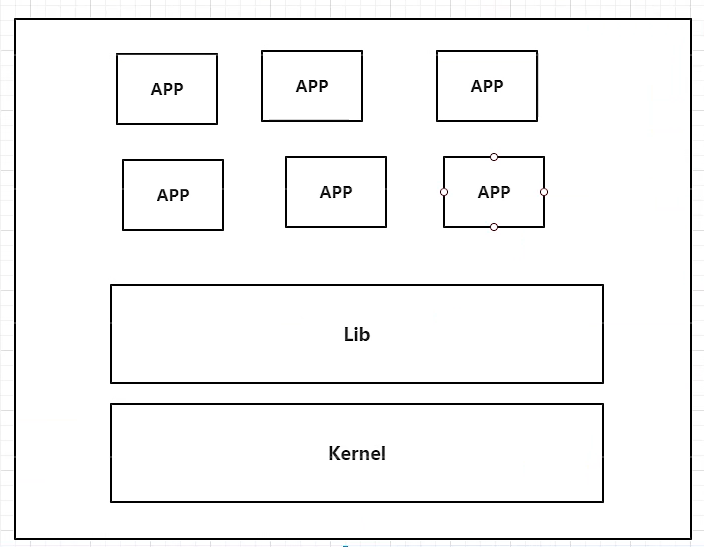

虚拟机的缺点：

- 资源占用多

- 冗余步骤多

- 启动慢

> #### 容器化技术：（容器化技术不是模拟的一个完整的操作系统）
> 
> 

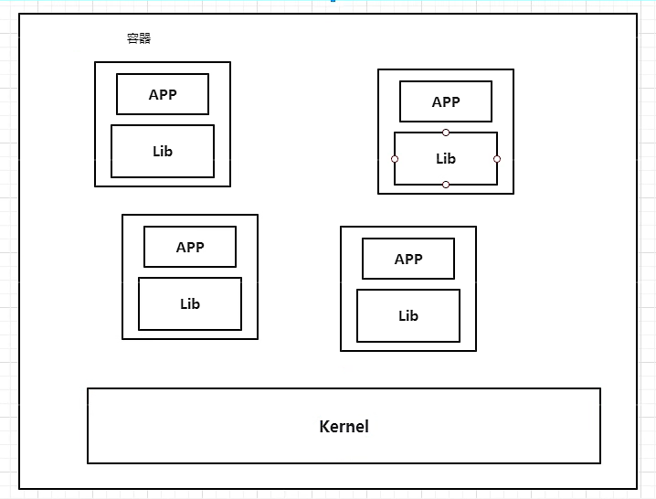

Docker和虚拟机技术的区别：

- 传统的虚拟机，可以虚拟出一条硬件，运行一个完整的操作系统，在这个操作系统上安装和运行所需的软件

- 容器内的应用可以直接运行在宿主 主机的内核中，容器没有自己的内核，也不用虚拟硬件 （轻便）

- 每个容器是相互隔离的，每个容器内都有属于自己的文件系统，之间互不影响。

> #### Devops：（开发，运维）
> 
> 

**1\. 应用于更快速的交付和部署** 

- 传统：通过大量的帮助文档，安装程序！

- Docker：打包镜像发布测试，一键运行！

**2\. 更便捷的升级和扩缩容** 

- 通过使用Docker，部署应用 如同搭积木一样！

**3\. 更简单的系统运维** 

- 使用容器化之后，开发和测试环境是高度一致的

**4\.更高效的计算资源利用** 

- Docker是内核级别的虚拟化，可以在一个物理机上运行很多的容器，让服务器的性能可以压榨到极致！

---

## 二、 Docker安装

### 2\.1 基本组成

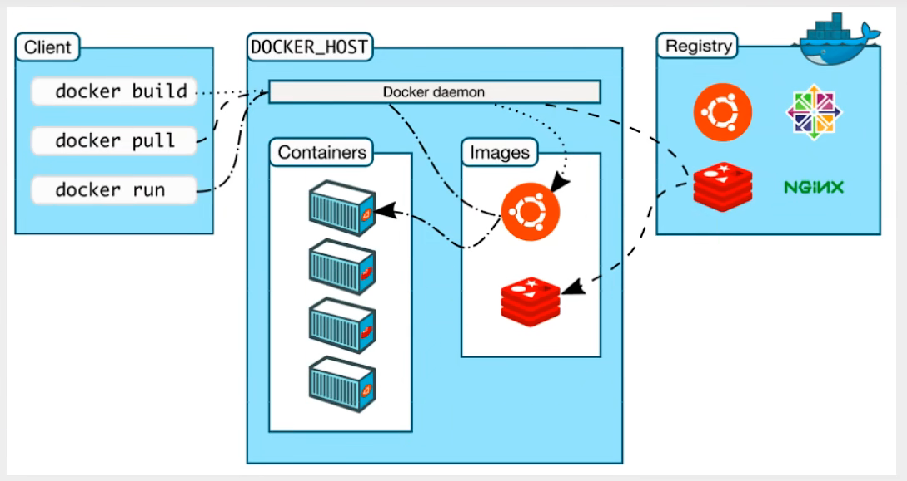

**镜像（Image）：** 

> docker镜像就好比一个模板，我们可以通过这个模板来创建容器服务，tomcat镜像===>run==>tomcat01容器（提供服务器），通过这个镜像可以创建多个容器（最终服务运行或者项目运行就是在容器中的）。

**容器（container）：** 

> docker利用容器技术，独立运行一个或者一组应用 通过镜像来创建
> 
> 启动，停止，删除，基本命令！
> 目前就可以把这个容器理解为就是一个简易的linux系统

**仓库（repository）：** 

> 仓库就是存放 镜像（image）的地方！
> 
> 仓库又可以分为 公有仓库和私有仓库

### 2\.2 安装Docker

> 环境查看

```
# 系统内核是 4.18 以上的
[root@JWei_0124 /]# uname -r
4.18.0-348.7.1.el8_5.x86_64

```

```
# 查看系统版本
[root@JWei_0124 /]# cat /etc/os-release 
NAME="CentOS Linux"
VERSION="8 (Core)"
ID="centos"
ID_LIKE="rhel fedora"
VERSION_ID="8"
PLATFORM_ID="platform:el8"
PRETTY_NAME="CentOS Linux 8 (Core)"
ANSI_COLOR="0;31"
CPE_NAME="cpe:/o:centos:centos:8"
HOME_URL="https://www.centos.org/"
BUG_REPORT_URL="https://bugs.centos.org/"

CENTOS_MANTISBT_PROJECT="CentOS-8"
CENTOS_MANTISBT_PROJECT_VERSION="8"
REDHAT_SUPPORT_PRODUCT="centos"
REDHAT_SUPPORT_PRODUCT_VERSION="8"

```

> 安装

[云服务器 搭建 Docker\-最佳实践\-文档中心\-腾讯云 \(tencent\.com\)](https://cloud.tencent.com/document/product/213/46000) 

```
# 1.卸载旧的版本
yum remove docker \
                  docker-client \
                  docker-client-latest \
                  docker-common \
                  docker-latest \
                  docker-latest-logrotate \
                  docker-logrotate \
                  docker-engine
# 2.需要的安装包
yum install -y yum-utils
# 3.设置镜像的仓库
yum-config-manager \
    --add-repo \
    https://download.docker.com/linux/centos/docker-ce.repo # 默认是从国外的。
yum-config-manager \
    --add-repo \
    http://mirrors.aliyun.com/docker-ce/linux/centos/docker-ce.repo # 推荐使用阿里云的。
# 安装容器之前，更新yum软件包索引。
yum makecache fast
# 4.安装容器相关的。docker-ce（社区版）docker-ee（企业版）
yum install docker-ce docker-ce-cli containerd.io
# 5.启动docker
systemctl start docker
# 6.使用docker version查看是否安装成功
```

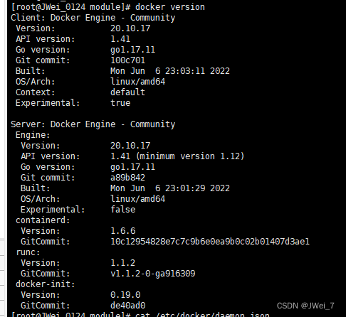

```
# 7.测试hello-world
docker run hello-world

```

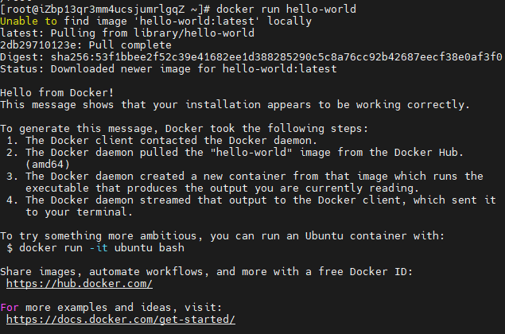

```
# 8.查看一下下载的这个hello-world镜像
```

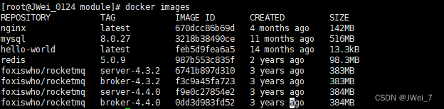

> 了解：卸载docker

```
# 1.卸载依赖
yum remove docker-ce docker-ce-cli containerd.io
# 2.删除资源
rm -rf /var/lib/docker
rm -rf /var/lib/containerd
# /var/lib/docker  docker的默认工作路径
```

### 2\.3 阿里云镜像加速

1. 登录阿里云，找到容器服务。

2. 找到镜像加速地址。

3. 配置使用。
   四个命令，依次执行即可：

```
1.
sudo mkdir -p /etc/docker
2.
sudo tee /etc/docker/daemon.json <<-'EOF'
{
"registry-mirrors": ["https://xxx.xxx.xxx.com"]
}
EOF

3.
sudo systemctl daemon-reload
4.
sudo systemctl restart docker
```

[腾讯云看这里](https://cloud.tencent.com/document/product/1207/45596) 

### 2\.4 回顾hello\-world流程


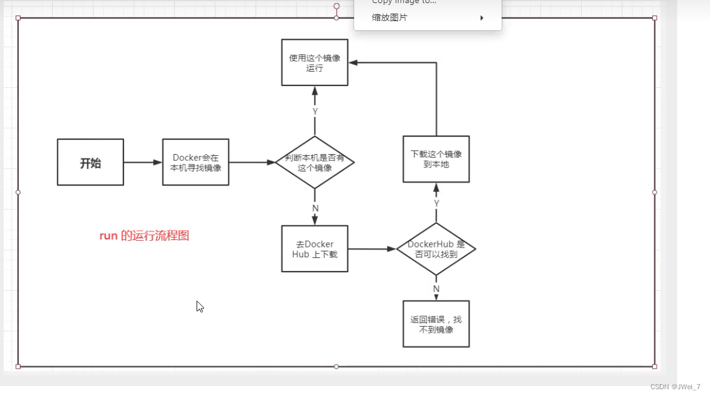

### 2\.5 底层原理

#### 2\.5\.1 docker是怎么工作的？

> Docker 是一个Client\-Server结构的系统，Docker的 **守护进程** 运行在主机上。
> 
> 通过Socket从客户端访问！
> 
> DockerServer 接收到Docker\-Client的指令，就会执行这个命令！

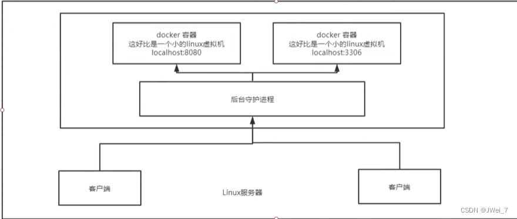

#### 2\.5\.2 docker为什么比VM（虚拟机）快？

1. Docker有着比虚拟机更少的抽象层。

2. docker利用的是宿主机的内核，vm需要是Guest OS。

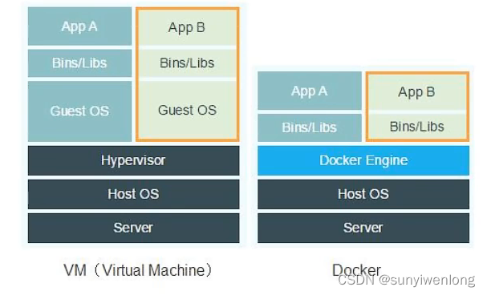

新建一个容器的时候，docker不需要像虚拟机一样重新加载一个操作系统内核，避免引导。
虚拟机是加载GuestOS，分钟级别的，而docker是利用宿主机的操作系统，省略了这个复杂的过程，秒级！

---

## 三、Docker的常用命令

### 3\.1 帮助命令

```
docker version        # 显示docker的版本信息
docker info              # 显示docker的系统信息，包括镜像和容器的数量
docker 命令 --help         # 帮助命令
```

帮助文档的地址： [Reference documentation | Docker Documentation](https://docs.docker.com/reference/) 

### 3\.2 镜像命令

#### 3\.2\.1 docker images

> 
> 
> 1. `REPOSITORY 镜像的仓库源`
> 
> 2. `TAG 镜像的标签`
> 
> 3. `IMAGE ID 镜像的id`
> 
> 4. `CREATED 镜像的创建时间`
> 
> 5. `SIZE 镜像的大小`
> 
> 6. `# 命令参数可选项`
> 
> 7. `-a, --all # 显示所有镜像 (docker images -a)`
> 
> 8. `-q, --quiet # 仅显示镜像id (docker images -q)`
> 
> 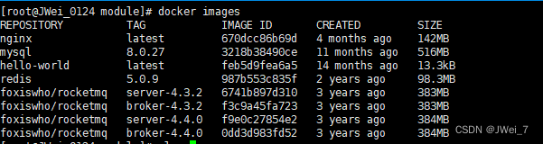
> 
> 

#### 3\.2\.2 docker search（搜索镜像）

> 
> 
> 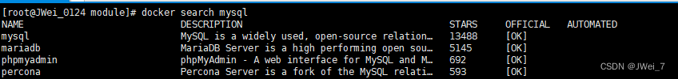
> 
> `解释` 
> 
> 1. `命令参数可选项 (通过搜索来过滤)`
> 
> 2. `--filter=STARS=3000 # 搜索出来的镜像就是stars大于3000的`
> 
> 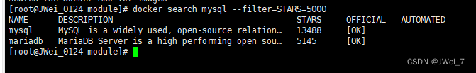
> 
> 

#### 3\.2\.3 docker pull（下载镜像）

```
# 下载镜像：docker pull 镜像名[:tag]
[root@iZbp13qr3mm4ucsjumrlgqZ ~]# docker pull mysql
Using default tag: latest            # 如果不写tag，默认就是latest，最新的版本
latest: Pulling from library/mysql
72a69066d2fe: Pull complete            # 分层下载，docker image的核心，联合文件下载
93619dbc5b36: Pull complete
99da31dd6142: Pull complete
626033c43d70: Pull complete
37d5d7efb64e: Pull complete
ac563158d721: Pull complete
d2ba16033dad: Pull complete
688ba7d5c01a: Pull complete
00e060b6d11d: Pull complete
1c04857f594f: Pull complete
4d7cfa90e6ea: Pull complete
e0431212d27d: Pull complete
Digest: sha256:e9027fe4d91c0153429607251656806cc784e914937271037f7738bd5b8e7709 #签名
Status: Downloaded newer image for mysql:latest
docker.io/library/mysql:latest        # 真实地址
# 两个命令是等价的
docker pull mysql
docker pull docker.io/library/mysql:latest
# 指定版本下载
[root@iZbp13qr3mm4ucsjumrlgqZ ~]# docker pull mysql:5.7
5.7: Pulling from library/mysql
72a69066d2fe: Already exists        # 联合文件下载，已经存在的资源可以共用
93619dbc5b36: Already exists
99da31dd6142: Already exists
626033c43d70: Already exists
37d5d7efb64e: Already exists
ac563158d721: Already exists
d2ba16033dad: Already exists
0ceb82207cd7: Pull complete
37f2405cae96: Pull complete
e2482e017e53: Pull complete
70deed891d42: Pull complete
Digest: sha256:f2ad209efe9c67104167fc609cca6973c8422939491c9345270175a300419f94
Status: Downloaded newer image for mysql:5.7
docker.io/library/mysql:5.7
```

#### 3\.2\.4 docker rmi（删除镜像）

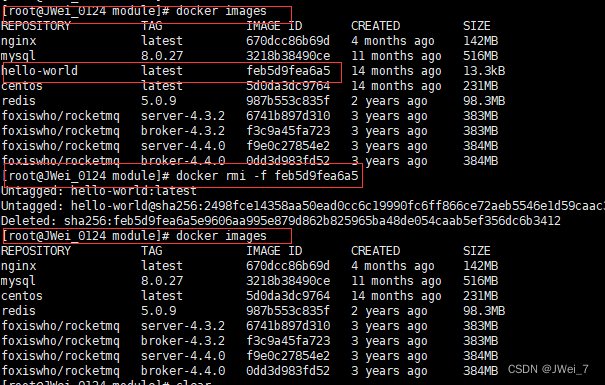

```
[root@JWei_0124 //]# docker rmi -f 镜像id                    # 删除指定的镜像
[root@JWei_0124 //]# docker rmi -f 镜像id 镜像id 镜像id    # 删除多个镜像（空格分隔）
[root@JWei_0124 //]# docker rmi -f $(docker images -aq)    # 删除全部的镜像
```

### 3\.3 容器命令

说明：我们有了镜像才可以创建容器，linux，下载一个centos 镜像来测试学习。

```
docker pull centos
```

#### 3\.3\.1 新建容器并启动

```
docker run [可选参数] image
# 参数说明
--name="name"        容器名字：用来区分容器
-d                    后台方式运行：相当于nohup
-it                    使用交互式运行：进入容器查看内容
-p                    指定容器的端口（四种方式）小写字母p
    -p ip:主机端口：容器端口
    -p 主机端口：容器端口
    -p 容器端口
    容器端口
-P                     随机指定端口（大写字母P）
# 测试：启动并进入容器
[root@JWei_0124 module]# docker run -it centos /bin/bash
[root@f8fad61a6c96 /]# ls  # 查看容器内的centos（基础版本，很多命令都是不完善的）
bin  dev  etc  home  lib  lib64  lost+found  media  mnt  opt  proc  root  run  sbin  srv  sys  tmp  usr  var

# 从容器中退回到主机
[root@f8fad61a6c96 /]# exit
exit
[root@JWei_0124 module]# 
[root@JWei_0124 /]# ls
bin  boot  dev  etc  home  lib  lib64  lost+found  media  mnt  opt  proc  root  run  sbin  srv  sys  tmp  usr  var  www
```

#### 3\.3\.2 列出所有运行的容器

```
docker ps    # 列出当前正在运行的容器
# 命令参数可选项
-a        # 列出当前正在运行的容器+历史运行过的容器
-n=?    # 显示最近创建的容器（可以指定显示几条，比如-n=1）
-q        # 只显示容器的编号

[root@JWei_0124 //]# docker ps 
CONTAINER ID   IMAGE     COMMAND   CREATED   STATUS    PORTS     NAMES
[root@JWei_0124 //]# docker ps -a
CONTAINER ID   IMAGE          COMMAND       CREATED         STATUS                          PORTS     NAMES
f8fad61a6c96   centos         "/bin/bash"   2 minutes ago   Exited (0) About a minute ago             epic_greider
b4b5e50d9889   centos         "/bin/bash"   2 minutes ago   Exited (0) 2 minutes ago                  suspicious_mendeleev
321c5e25bca9   feb5d9fea6a5   "/hello"      2 hours ago     Exited (0) 2 hours ago                    wonderful_saha
[root@JWei_0124 //]# docker ps -a -n=1
CONTAINER ID   IMAGE     COMMAND       CREATED         STATUS                          PORTS     NAMES
f8fad61a6c96   centos    "/bin/bash"   2 minutes ago   Exited (0) About a minute ago             epic_greider
[root@JWei_0124 //]# 

```

#### 3\.3\.3 退出容器

```
exit        # 容器直接停止，并退出
ctrl+P+Q    # 容器不停止，退出
[root@JWei_0124 //]# docker run -it centos /bin/bash  //交互式进入
[root@68b68a9576e0 /]# [root@JWei_0124 //]#  //按快捷键 自动输入
[root@JWei_0124 //]# docker ps
CONTAINER ID   IMAGE     COMMAND       CREATED         STATUS         PORTS     NAMES
68b68a9576e0   centos    "/bin/bash"   2 minutes ago   Up 2 minutes             peaceful_jemison
[root@JWei_0124 //]# 

```

#### 3\.3\.4 删除容器

```
docker rm 容器id                    # 删除容器（不能删除正在运行的容器）如果要强制删除：docker rm -f 容器id
docker rm -f $(docker ps -aq)        # 删除全部容器
docker ps -a -q|xargs docker rm        # 删除所有容器
```

#### 3\.3\.5 启动和停止容器的操作

```
docker start 容器id        # 启动容器
docker restart 容器id    # 重启容器
docker stop 容器id        # 停止当前正在运行的容器
docker kill 容器id        # 强制停止当前容器
```

### 3\.4 常用其他命令

#### 3\.4\.1 后台启动容器

```
# 命令docker run -d 镜像名
[root@JWei_0124 //]# docker run -d centos
5b06d0d14b3312e589a411dd9ae15589dc9321f771e5615b7ae26e85017de080
# 问题：docker ps发现centos停止了
# 常见的坑：docker容器使用后台运行，就必须要有要一个前台进程，docker发现没有应用，就会自动停止。
# 比如：nginx，容器启动后，发现自己没有提供服务，就会立刻停止，就是没有程序了
```

#### 3\.4\.2 查看日志

```
docker logs -tf --tail 容器id
# 自己编写一段shell脚本
docker run -d centos /bin/sh -c "while true;do echo kuangshen;sleep 1;done"
[root@JWei_0124 //]# docker logs -tf  容器id
[root@JWei_0124 //]# docker logs -tf --tail 10  容器id
# 显示日志
-tf                        # 显示日志
--tail number    # 要显示的日志条数
```

#### 3\.4\.3 查看容器中进程的信息

```
# 命令 docker top 容器id 
[root@JWei_0124 ~]# docker ps
CONTAINER ID   IMAGE     COMMAND                  CREATED              STATUS              PORTS      NAMES
25eb9d70b2b4   redis     "docker-entrypoint.s…"   About a minute ago   Up About a minute   6379/tcp   awesome_chatterjee
[root@JWei_0124 ~]# docker top 25eb9d70b2b4
UID                 PID                 PPID                C                   STIME               TTY                 TIME                CMD
systemd+            181442              181422              0                   09:47               ?                   00:00:00            redis-server *:6379

```

#### 3\.4\.4 查看镜像的元数据

`命令docker inspect 容器id` 

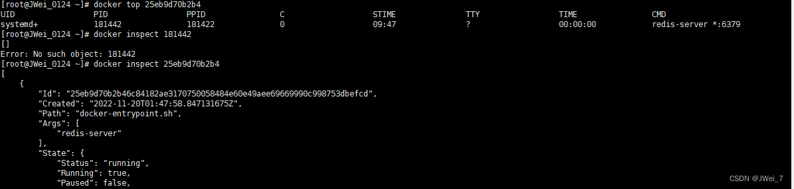

#### 3\.4\.5 进入当前正在运行的容器

```
# 我们通常容器都是使用后台方式运行的，需要进入容器，修改一些配置
# 命令
docker exec -it 容器id /bin/bash
# 测试
[root@JWei_0124 ~]# docker ps
CONTAINER ID   IMAGE     COMMAND                  CREATED          STATUS          PORTS     NAMES
88d23bcbe1f2   centos    "/bin/sh -c 'while t…"   13 minutes ago   Up 13 minutes             silly_lichterman
[root@JWei_0124 ~]# docker exec -it 88d23bcbe1f2 /bin/bash
[root@88d23bcbe1f2 /]# ps -ef
UID        PID  PPID  C STIME TTY          TIME CMD
root         1     0  0 08:23 ?        00:00:00 /bin/sh -c while true;do echo kuangshen;sleep 1;done
root       841     0  0 08:37 pts/0    00:00:00 /bin/bash
root       858     1  0 08:37 ?        00:00:00 /usr/bin/coreutils --coreutils-prog-shebang=sleep /usr/bin/sleep 1
root       859   841  0 08:37 pts/0    00:00:00 ps -ef
# 方式二
docker attach 容器id
# 测试
[root@JWei_0124  ~]# docker attach 88d23bcbe1f2
正在执行当前的代码...
# docker exec        # 进入容器后开启一个新的终端，可以再里面操作（常用）
# docker attach        # 进入容器正在执行的终端，不会启动新的进程。
```

#### 3\.4\.6 从容器内拷贝文件到主机

```
docker cp 容器id:容器内路径 目的主机的路径
[root@iZbp13qr3mm4ucsjumrlgqZ home]# ll
total 0
[root@iZbp13qr3mm4ucsjumrlgqZ home]# docker ps
CONTAINER ID   IMAGE     COMMAND   CREATED   STATUS    PORTS     NAMES
[root@iZbp13qr3mm4ucsjumrlgqZ home]# docker run -it centos /bin/bash
[root@6eda31ad7987 /]# [root@iZbp13qr3mm4ucsjumrlgqZ home]# docker ps
CONTAINER ID   IMAGE     COMMAND       CREATED          STATUS          PORTS     NAMES
6eda31ad7987   centos    "/bin/bash"   17 seconds ago   Up 16 seconds             stoic_kepler
# 进入到容器内部
[root@iZbp13qr3mm4ucsjumrlgqZ home]# docker attach 6eda31ad7987
[root@6eda31ad7987 /]# ls
bin  dev  etc  home  lib  lib64  lost+found  media  mnt  opt  proc  root  run  sbin  srv  sys  tmp  usr  var
[root@6eda31ad7987 /]# cd /home/
[root@6eda31ad7987 home]# ls
# 在容器的/home路径下创建test.java文件
[root@6eda31ad7987 home]# touch test.java
[root@6eda31ad7987 home]# ls
test.java
[root@6eda31ad7987 home]# exit
exit
[root@iZbp13qr3mm4ucsjumrlgqZ home]# docker ps
CONTAINER ID   IMAGE     COMMAND   CREATED   STATUS    PORTS     NAMES
[root@iZbp13qr3mm4ucsjumrlgqZ home]# docker ps -a
CONTAINER ID   IMAGE     COMMAND       CREATED              STATUS                      PORTS     NAMES
6eda31ad7987   centos    "/bin/bash"   About a minute ago   Exited (0) 28 seconds ago             stoic_kepler
# 将文件拷贝出来到主机上（在主机上执行该命令）
[root@iZbp13qr3mm4ucsjumrlgqZ home]# docker cp 6eda31ad7987:/home/test.java /home
[root@iZbp13qr3mm4ucsjumrlgqZ home]# ls
test.java
# 拷贝是一个手动过程，未来我们使用 -v 卷的技术，可以实现，自动同步（容器内的/home路径和主机上的/home路径打通）
```

### 3\.5 小结 （常用命令汇总）

[docker常用命令\_JWei\_7的博客\-CSDN博客](https://blog.csdn.net/qq_54729417/article/details/127945665?csdn_share_tail=%7B%22type%22%3A%22blog%22%2C%22rType%22%3A%22article%22%2C%22rId%22%3A%22127945665%22%2C%22source%22%3A%22qq_54729417%22%7D) 

[Docker常用命令原理图\_胡伟煌的博客\-CSDN博客](https://blog.csdn.net/huwh_/article/details/71308119) 这个是一个大佬写的原理图！！！ yyds

#### 3\.6 练习安装Nginx

1\. 搜索镜像：docker search nginx \(建议去dockerHub上去搜索\)

2\. 下载镜像：docker pull nginx

3\. 启动镜像

```
 # -d 后台运行
 # --name="nginx01"    给容器命名
 # -p 宿主机端口:容器内部端口

[root@JWei_0124 ~]# docker run -d --name nginx01 -p 3344:80 nginx
a96ced70d4c970b8b77d48b218c682a9efd090f89503b9b5bb402c345e77762f
[root@JWei_0124 ~]# docker ps 
CONTAINER ID   IMAGE     COMMAND                  CREATED          STATUS         PORTS                                   NAMES
a96ced70d4c9   nginx     "/docker-entrypoint.…"   10 seconds ago   Up 9 seconds   0.0.0.0:3344->80/tcp, :::3344->80/tcp   nginx01

```

4\. 测试访问

```
[root@JWei_0124 ~]# curl localhost:3344
<!DOCTYPE html>
<html>
<head>
<title>Welcome to nginx!</title>
<style>
html { color-scheme: light dark; }
body { width: 35em; margin: 0 auto;
font-family: Tahoma, Verdana, Arial, sans-serif; }
</style>
</head>
<body>
<h1>Welcome to nginx!</h1>
<p>If you see this page, the nginx web server is successfully installed and
working. Further configuration is required.</p>

<p>For online documentation and support please refer to
<a href="http://nginx.org/">nginx.org</a>.<br/>
Commercial support is available at
<a href="http://nginx.com/">nginx.com</a>.</p>

<p><em>Thank you for using nginx.</em></p>
</body>
</html>
[root@JWei_0124 ~]# 

```

5\. 接口暴露

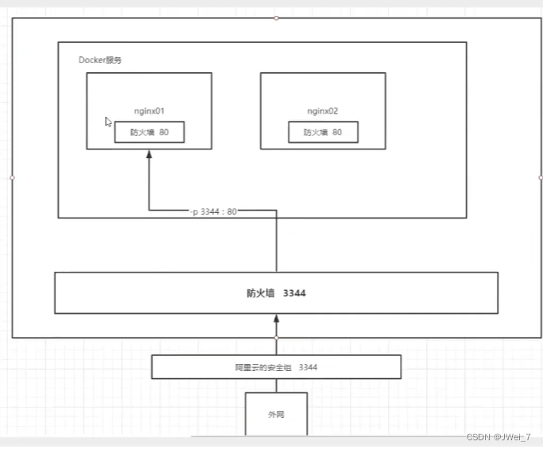

### 3\.6 Docker可视化界面工具

#### 3\.6\.1 什么是portainer ?

Docker图形化界面管理工具！提供一个后台面板供我们操作！

类似于 宝塔面板

#### 3\.6\.2 安装

8088 外网访问端口 9000 是内部映射端口

```
docker run -d -p 8088:9000 --restart=always -v /var/run/docker.sock:/var/run/docker.sock --privileged=true portainer/portainer
```

访问测试： [http://ip:8088](http://ip:8088/) 

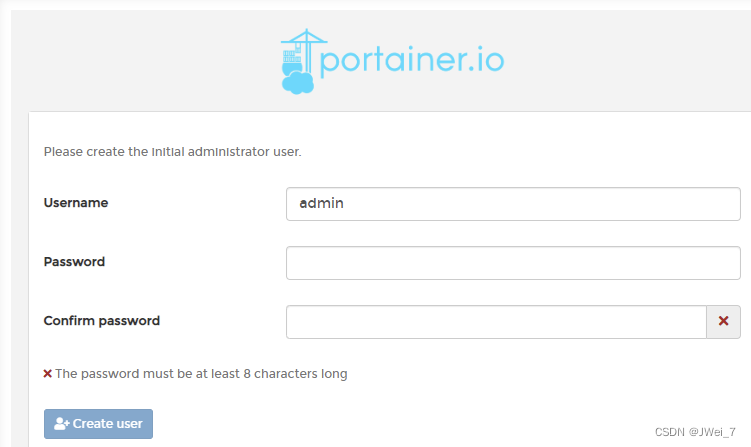

选择本地的：Local

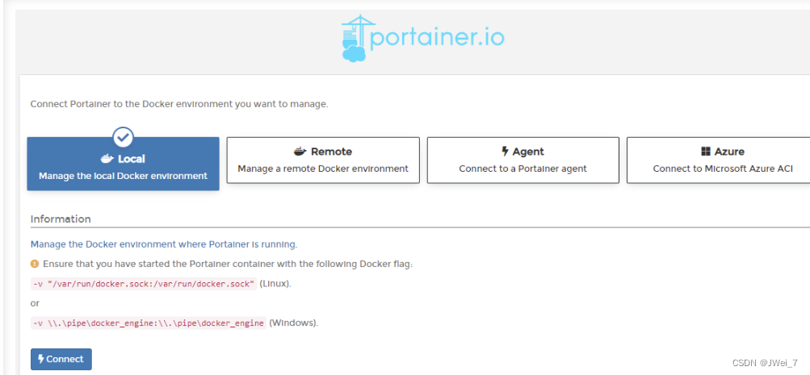

进入之后的面板

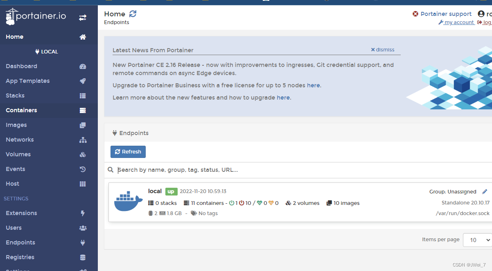

---

## 四、Docker镜像

### 4\.1 镜像是什么

> ```
>     镜像是一种轻量级，可执行化的独立软件包，用来打包软件运行环境和基于运行环境开发的软件，它包含运行某个软件锁需要的所有内容，包括代码，运行时（库，环境变量和配置文件）
> 
>     所有的应用 直接打包docker 镜像 就可以直接跑起来！
> ```

### 4\.2 镜像加速原理

#### 4\.2\.1 UnionFS（联合文件系统）

我们下载的时候看到的一层层就是这个！

> ```
>     UnionFS（联合文件系统）：Union文件系统（UnionFS）是一种分层、轻量级并且高性能的文件系统，它支持对文件系统的修改作为一次提交来一层层的叠加，同时可以将不同目录挂载到同一个虚拟文件系统下（unite several directories into a single virtual filesystem）。Union 文件系统是Docker 镜像的基础。镜像可以通过分层来进行继承，基于基础镜像（没有父镜像），可以制作各种具体的应用镜像。
> ```

```
    **特性：**一次同时加载多个文件系统，但从外面看起来，只能看到一个文件系统，联合加载会把各层文件系统叠加起来，这样最终的文件系统会包含所有底层的文件和目录。
```

#### 4\.2\.2 Docker 镜像加载原型

docker的镜像实际上由一层一层的文件系统组成，这种层级的文件系统UnionFS。

> \*\*bootfs（boot file system）\*\*主要包含bootloader和kernel，bootloader主要是引导加载kernel，Linux刚启动时会加载bootfs文件系统，在Docker镜像的最底层是bootfs。这一层与我们典型的Linux/Unix系统是一样的，包含boot加载器和内核。当boot加载完成之后整个内核就都在内存中了，此时内存的使用权已由bootfs转交给内核，此时系统也会卸载bootfs。

> **rootfs（root file system）** ，在bootfs之上。包含的就是典型Linux系统中的/dev，/proc，/bin，/etc等标准目录和文件。
> rootfs就是各种不同的操作系统发行版，比如Ubuntu，Centos等等。

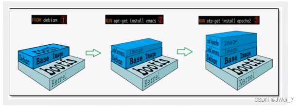

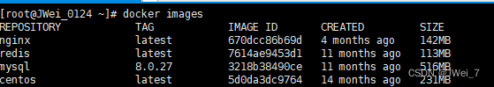

> 平时我们安装进虚拟机的CentOS都是好几个G，为什么Docker这里才200M？

```
    对于一个精简的OS，rootfs可以很小，只需要包含最基本的命令，工具和程序库就可以了，因为底层直接用Host的kernel，自己只需要提供rootfs就可以了。  
    由此可见对于不同的linux发行版，bootfs基本是一致的，rootfs会有差别，因此不同的发行版可以公用bootfs。  
```

（虚拟机是分钟级，容器是秒级！）

### 4\.3 分层理解

> 分层镜像

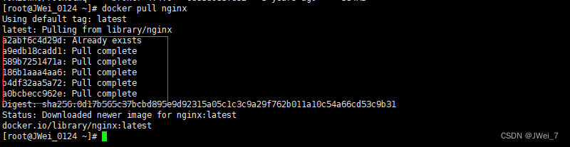

我们可以去下载一个镜像，注意观察下载的日志输出，可以看到是一层一层的在下载！

> Docker镜像要采用这种分层的好处？

```
    **资源共享**      有多个镜像都从相同的Base镜像构建而来，那么宿主机只需在磁盘上保留一份base镜像，同时内存中也只需要加载一份base镜像，这样就可以为所有的容器服务了，而且镜像的每一层都可以被共享。

    所有的Docker 镜像都起始于一个基础镜像层，当进行修改或增加新的内容时，就会在当前镜像层之上，创建新的镜像层。  
```

举一个简单的例子，假如基于Ubuntu Linux 16\.04创建一个新的镜像，这就是新镜像的第一层；如果在该镜像中添加Python包，就会在基础镜像层之上创建第二个镜像层；如果继续添加一个安全补丁，就会创建第三个镜像层。

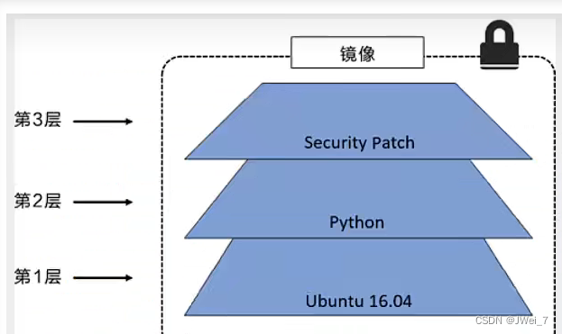

```
    简单来说 就是 原本有的   就共享  没有的咱就下载  更新了 就替换新的
```

**特点：** 

```
    Docker镜像都是只读的，当容器启动时，一个新的可写层被加载到镜像的顶部！  
    这一层就是我们通常说的容器层，容器之下的都叫镜像层！
```

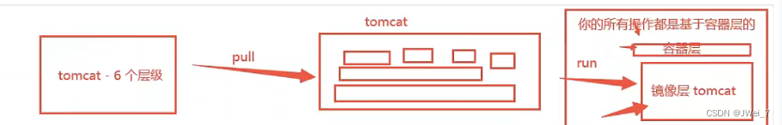

### 4\.4 commit镜像

```
# 提交容器成为一个新的副本
docker commit
# 命令和git原理类似
docker commit -m="提交的描述信息" -a="作者" 容器id 目标镜像名:[TAG]
```

> \# 1\.启动一个默认的tomcat。
> \# 2\.发现这个默认的tomcat是没有webapps应用，镜像的原因，官方的镜像默认webapps下面是没有文件的。
> \# 3\.我自己拷贝进去了基本的文件。
> \# 4\.将我们操作过的容器通过commit提交为一个镜像！我们以后就使用我们修改过的镜像即可，这就是我们自己的一个修改的镜像。
> 
> 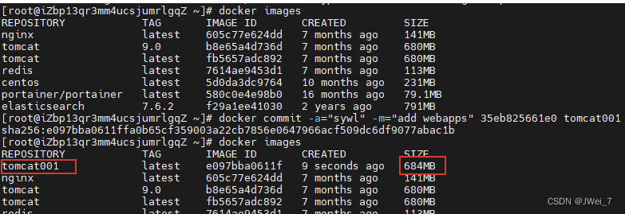
> 
> 

小结： commit镜像就是游戏存档 tag是版本版本信息

---

## 五、 容器数据卷

### 5\.1 什么是容器数据卷？

Docker容器数据卷，即Docker Volume（卷）。

> ```
>     当Docker容器运行的时候，会产生一系列的数据文件，这些数据文件会在关闭Docker容器时，直接消失的。但是其中产生部分的数据内容，我们是希望能够把它给保存起来，另作它用的。
> 
>     关闭Docker容器=删除内部除了image底层数据的其他全部内容，即删库跑路
> ```

所以我们期望：

> 将应用与运行的环境打包形成容器运行，伴随着容器运行产生的数据，我们希望这些数据能够持久化。
> 希望容器之间也能够实现数据的共享、

- Docker容器产生的数据同步到本地,这样关闭容器的时候，数据是在本地的，不会影响数据的安全性。

- docker的容器卷技术也就是将容器内部目录和本地目录进行一个同步，即挂载。

**总结： 容器的持久化和同步化操作，容器之间也是可以数据共享的（但是注意挂载不是等同于同步！！！）** 

### 5\.2 使用数据卷

**使用命令来挂载 \-v** 

主机目录和容器内的目录是映射关系

```
docker run -it -v 主机目录:容器内目录 镜像名 /bin/bash
# 测试，查看容器信息
docker inspect 容器id
```

- mounts 加载的文件系统

- source 是源地址 就是 当前你这个docker里面的地址目录

- destination 是 这个容器的目录

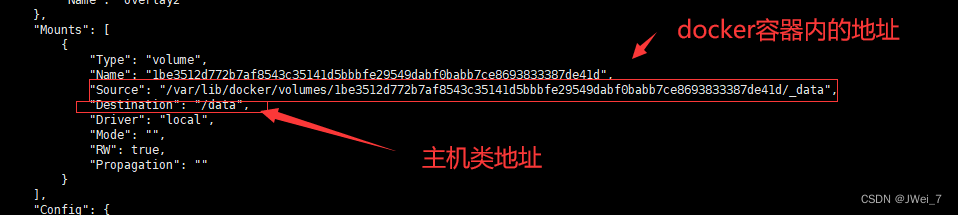

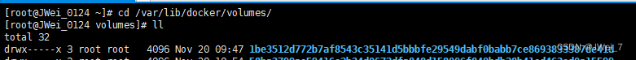

> 通过 \-v挂载目录后 会对这个俩个目录中的数据进行 双向绑定（bind）

在容器的/home文件夹下，新建test\.java文件，会同步到主机的/home/ceshi文件夹下。
`删除操作也是同步的；双向绑定，保证两边文件夹下的数据始终是一直的。` 

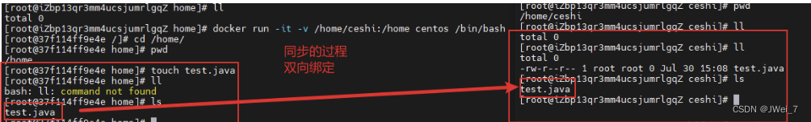

```
    停止容器后，在主机的/home/ceshi文件夹下，修改文件或新增文件，启动容器，查看容器的/home文件夹，发现容器内的数据依旧是同步的
```

1. 停止容器。

2. 宿主机上修改文件。

3. 启动容器。

4. 容器内的数据依旧是同步的。

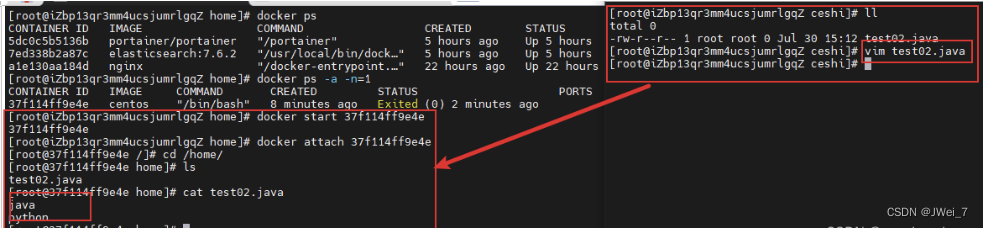

```
     好处：我们以后修改只需要在本地修改即可，容器内会自动同步！
```

### 5\.3 安装MySQL

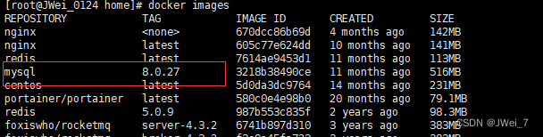

```
# 获取镜像
docker pull mysql:5.7
# 运行容器，需要做数据目录挂载。（安装启动mysql，注意：需要配置密码）
# 官方启动mysql
docker run --name some-mysql -e MYSQL_ROOT_PASSWORD=my-secret-pw -d mysql:tag
# 我们启动mysql（-e是环境配置）
[root@JWei_0124 home]# docker run -d -p 8081:3306
 -v /home/mysql/conf:/etc/mysql/conf.d -v /home/mysql/data:/var/lib/mysql 
-e MYSQL_ROOT_PASSWORD=123456 --name mysql01 mysql:8.0.27
# 启动成功之后，我们在本地使用navicat来接测试一下。
# navicat连接到服务器的8081端口和容器内的3306映射，这个时候我们就可以连接上了！
# 在本地测试创建一个数据库，查看一下我们映射的路径是否ok！（OK的）
```

在navicat上 创建一个数据库

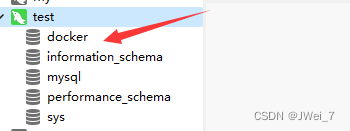

查看本地

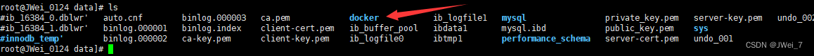

现在 删除 容器

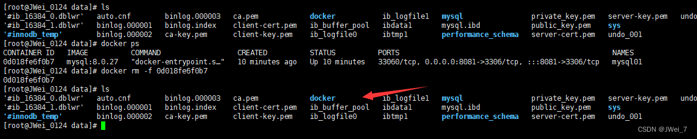

发现，我们挂载到本地的数据卷依旧没有丢失，这就实现了容器数据持久化功能！

### 5\.4 匿名挂载和具名挂载

```
# 匿名挂载
docker run -d -p --name nginx01 -v /etc/nginx nginx
# 查看所有的volume的情况
[root@JWei_0124 ~]# docker volume ls
DRIVER    VOLUME NAME
local     964b8e505f12f65fb23fd21f05cfa9ecd6c2c6b2ca89c0e44f168bb017dfabd6
# 这种就是匿名挂载：我们在-v挂载目录时，只写了容器内的路径，没有写容器外的路径。
# 具名挂载
[root@JWei_0124 ~]# docker run -d -p 3344:80 --name nginx02 -v juming-nginx:/etc/nginx nginx
[root@JWei_0124 home]# docker volume ls
DRIVER    VOLUME NAME
local     1be3512d772b7af8543c35141d5bbbfe29549dabf0babb7ce8693833387de41d
local     58ba3799ae59416c2b34d0672dfa848d158006f840bdb28b41ed463ed0a15599
# 通过 -v 卷名:容器内的路径（具名挂载）
# 查看一下这个卷
```

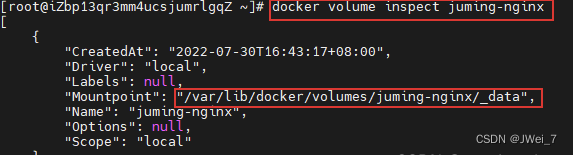

所有的docker容器内的卷，没有指定目录的情况下都是在 `/var/lib/docker/volumes/xxxx/_data"` （xxxx是卷名）
我们通过具名挂载可以方便的找到我们的一个卷， `大多数情况在使用的具名挂载` 

```
# 如何确定是具名挂载，还是匿名挂载，还是指定路径挂载
-v 容器内的路径                # 匿名挂载
-v 卷名:容器内的路径        # 具名挂载
-v /宿主机路径:容器内路径    # 指定路径挂载
```

拓展

```
# 通过 -v 容器内的路径:ro    rw    改变读写权限
ro    read only    # 只读
rw    read write    # 可读可写
# 一旦设置了容器权限，容器对我们挂载出来的内容就有了限定。
docker run -d -p 3344:80 --name nginx02 -v juming-nginx:/etc/nginx:ro nginx
docker run -d -p 3344:80 --name nginx02 -v juming-nginx:/etc/nginx:rw nginx
# 只要看到ro就说明这个路径只能通过宿主机来操作，容器内部是无法操作！
```

### 5\.5 Dockerfile

dockerfile 就是用来构建 docker 镜像的构建文件。 命令<span style="color: #3391E5">脚本</span>！

通过这个脚本可以生成镜像，镜像是一层一层的，脚本一个一个的命令，每个命令都是一层！

```
# 创建一个dockerfile文件，名字可以随机，建议dockerfile
# 文件中的内容：指令都是大写
FROM centos
VOLUME ["volume01","volume02"]
CMD echo "-----end-----"
CMD /bin/bash
# 这里的每个命令，就是镜像的一层。
```

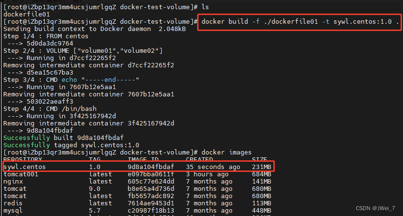

启动容器：

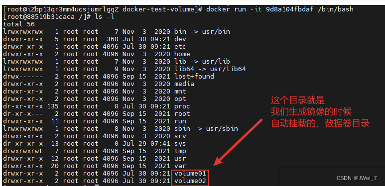

这个卷根外部一定有一个同步的目录！

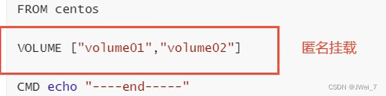

查看一下卷挂载的路径：docker inspect 容器id

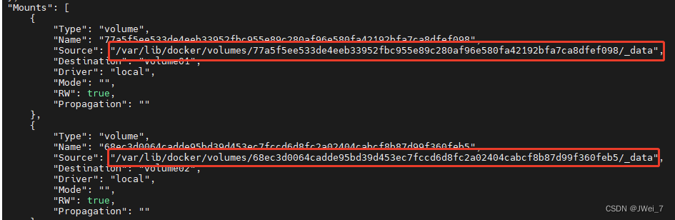

测试一下文件是否同步出去：在容器的volume01文件夹下创建文件，查看宿主机对应目录是否同步成功。
`这种方式我们未来使用的十分多，因为我们通常会构建自己的镜像！` 
如果构建镜像时候没有挂载卷，就需要自己手动镜像挂载目录！

### 5\.6 数据卷容器

多个容器同步数据（临时认父）

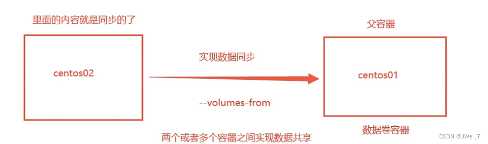

> `启动3个容器，通过我们刚才自己的写镜像启动。` 

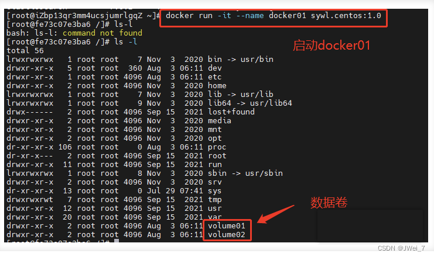

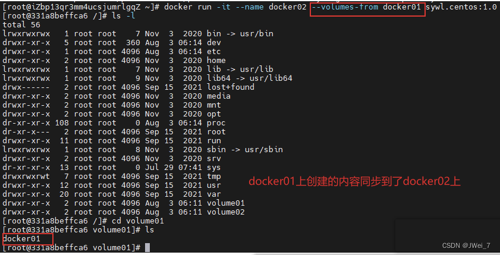

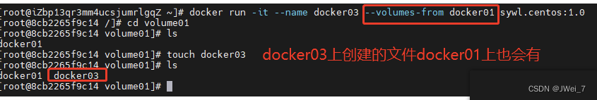

> ```
>     三个容器的数据是 互相拷贝的  删除任意一个 其余的容器都可以看到那些数据  当然 所以的容器都删了  也就会删除了 除非做了持久化映射 
> ```

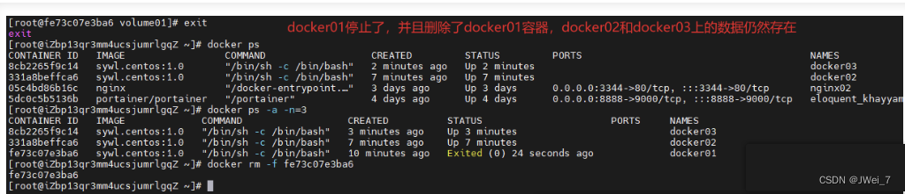

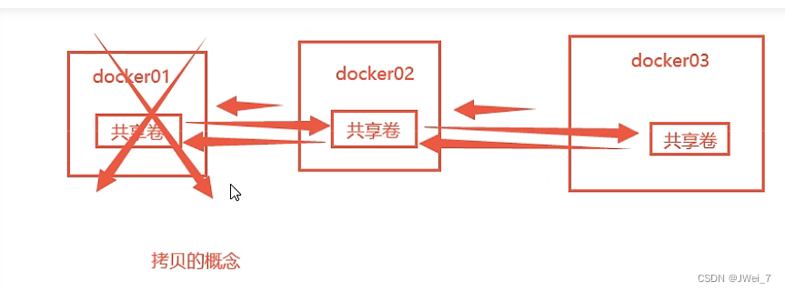

> 多个mysql实现数据共享：

```
[root@iZbp13qr3mm4ucsjumrlgqZ ~]# docker run -d -p 7777:3306 -v 
/home/mysql/conf:/etc/mysql/conf.d -v /home/mysql/data:/var/lib/mysql -e 
MYSQL_ROOT_PASSWORD=123456 --name mysql01 mysql:5.7
[root@iZbp13qr3mm4ucsjumrlgqZ ~]# docker run -d -p 7777:3306 -e
 MYSQL_ROOT_PASSWORD=123456 --name mysql02 --volumes-from mysql01 mysql:5.7
# 这个时候，可以实现两个容器数据同步！
```

**结论：** 
容器之间配置信息的传递，数据卷容器的生命同期一直持续到没有容器使用为止。
但是一旦你持久化到了本地，这个时候，本地的数据是不会删除的！

---

## 六、DockerFile

### 6\.1 什么是DockerFile ？

> dockerfile是用来构建docker镜像的文件！命令参数脚本！

构建步骤：
1、编写一个dockerfile文件
2、docker build 构建成为一个镜像
3、docker run运行镜像
4、docker push发布镜像（DockerHub、阿里云镜像仓库！）

### 6\.2 搭建步骤

1、每个保留关键字（指令）都是必须是大写字母
2、执行从上到下顺序执行
3、\# 表示注释
4、每一个指令都会创建提交一个新的镜像层，并提交！

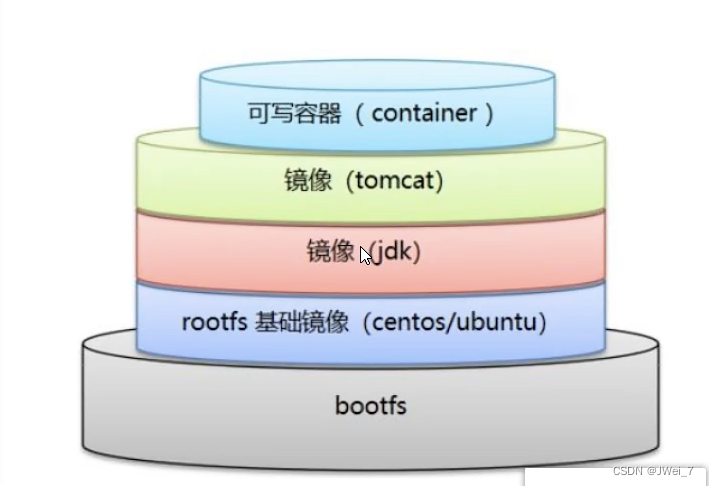

dockerfile是面向开发的，我们以后要发布项目，做镜像，就需要编写dockerfile文件，这个文件十分简单！

DockerFile：构建文件，定义了一切的步骤，源代码。
Dockerlmages：通过DockerFile构建生成的镜像，最终发布和运行的产品。
Docker容器：容器就是镜像运行起来提供服务的。

### 6\.3 DockerFile的命令

```
FROM        # 基础镜像，一切从这里开始构建
MAINTAINER    # 镜像是谁写的：姓名+邮箱
RUN            # 镜像构建的时候需要运行的命令
ADD            # 步骤：tomcat镜像，这个tomcat压缩包！添加内容
WORKDIR        # 镜像的工作目录
VOLUME        # 挂载的目录
EXPOSE        # 暴露端口配置
CMD            # 指定这个容器启动的时候要运行的命令，只有最后一个会生效，可被替代
ENTRYPOINT    # 指定这个容器启动的时候要运行的命令，可以追加命令
ONBUILD        # 当构建一个被继承DockerFile这个时候就会运行ONBUILD的指令。触发指令。
COPY        # 类似ADD，将我们文件拷贝到镜像中
ENV            # 构建的时候设置环境变量！
```

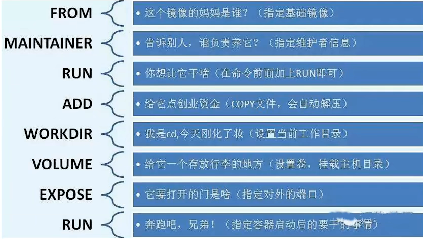

### 6\.4 测试

> ```
>     Docker Hub中99%镜像都是从这个基础镜像过来的FROM scratch，然后配置需要的软件和配置来进行的构建。
> ```

```
# 1. 编写dockerfile的文件
FROM centos:7
MAINTAINER sywl<xxx@qq.com>
ENV MYPATH /usr/local
WORKDIR $MYPATH
RUN yum -y install vim
RUN yum -y install net-tools
EXPOSE 80
CMD echo $MYPATH
CMD echo "-----end-----"
CMD /bin/bash
# 2. 通过这个文件构建镜像
# 命令：docker build -f dockerfile文件路径 -t 镜像名:[tag]
docker build -f mydockerfile-centos -t mycentos:0.1 .
Successfully built 285c2064af01
Successfully tagged mycentos:0.1
# 3. 测试运行
```

之前的原生的centos7：

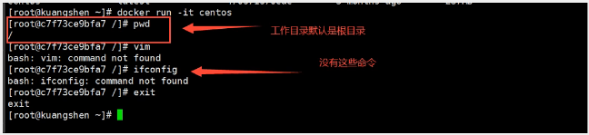

我们增加之后的镜像：

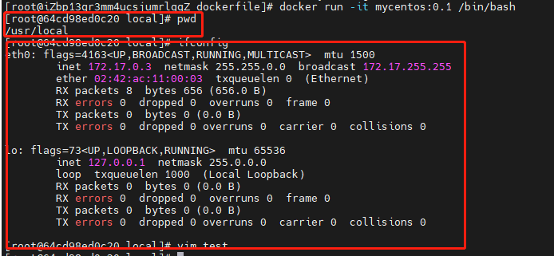

我们可以列出本地进行的变更历史：docker history 镜像id

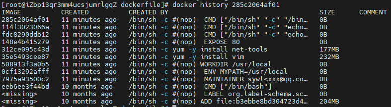

> CMD和ENTRYPOINT区别

```
CMD            # 指定这个容器启动的时候要运行的命令，只有最后一个会生效，可被替代
ENTRYPOINT     # 指定这个容器启动的时候要运行的命令，可以追加命令
```

测试CMD

```
# 1. 编写dockerfile文件
[root@iZbp13qr3mm4ucsjumrlgqZ dockerfile]# vim mydockerfile-cmd-test
[root@iZbp13qr3mm4ucsjumrlgqZ dockerfile]# cat mydockerfile-cmd-test
FROM centos:7
CMD ["ls","-a"]
# 2. 构建镜像
[root@iZbp13qr3mm4ucsjumrlgqZ dockerfile]# docker build -f mydockerfile-cmd-test -t cmdtest .
# 3. run运行，发现我们的"ls -a"命令生效、执行
```

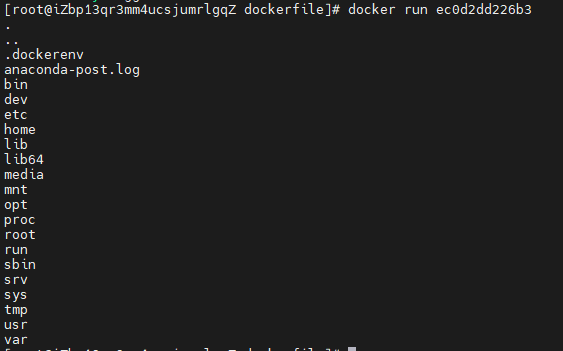

```
# 4. 我们先追加一个命令"l",构成"ls -al"命令，发现报错
[root@iZbp13qr3mm4ucsjumrlgqZ dockerfile]# docker run ec0d2dd226b3 -l
docker: Error response from daemon: failed to create shim task: OCI runtime create failed: runc create failed: unable to start container process: exec: "-l": executable file not found in $PATH: unknown.
ERRO[0000] error waiting for container: context canceled
# 原因：CMD命令的情况下，"-l"替换了CMD["1s"，"-a"]命令，因为"-l"不是命令，所以报错！
```

测试ENTRYPOINT

```
# 1. 编写dockerfile文件
[root@iZbp13qr3mm4ucsjumrlgqZ dockerfile]# vim mydockerfile-entrypoint-test
[root@iZbp13qr3mm4ucsjumrlgqZ dockerfile]# cat mydockerfile-entrypoint-test
FROM centos:7
ENTRYPOINT ["ls","-a"]
# 2. 构建镜像
[root@iZbp13qr3mm4ucsjumrlgqZ dockerfile]# docker build -f mydockerfile-entrypoint-test -t entrypointtest .
# 3. run运行，发现我们的"ls -a"命令生效、执行
```

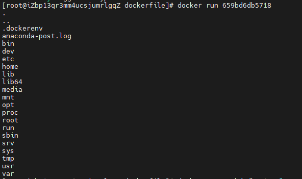

```

# 4. 我们先追加一个命令"l",构成"ls -al"命令，发现命令生效、执行
```

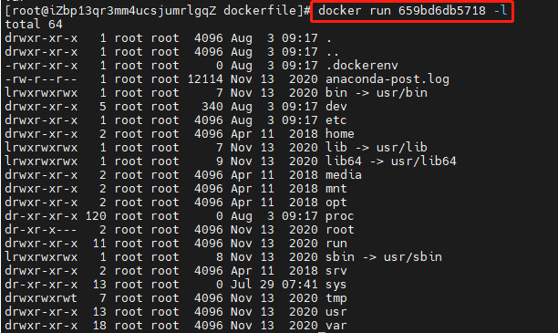

```
# 原因：ENTRYPOINT命令的情况下，"-l"追加在ENTRYPOINT ["1s"，"-a"]命令后面，得到"ls -al"的命令，所以命令正常执行！
# （我们的追加命令，是直接拼接在我们的ENTRYPOINT命令的后面）
```

### 6\.5 小结


---

## 七、 Docker 网络

### 7\.1 docker0

清空所有的环境

> 测试

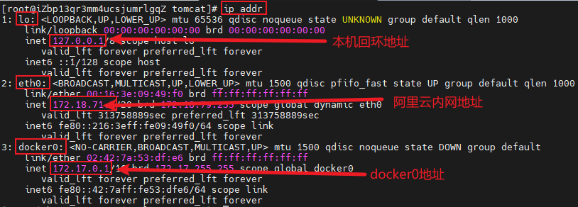

三个

> \# 问题：docker是如何处理容器网络访问的？

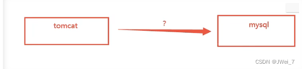

```
[root@JWei_0124 ~]# docker run -d -P --name tomcat01 tomcat
# 查看容器的内部网络地址ip addr，发现容器启动的时候会得到一个eth0@if119的ip地址（docker分配的）
[root@JWei_0124~]# docker exec -it tomcat01 ip addr
1: lo: <LOOPBACK,UP,LOWER_UP> mtu 65536 qdisc noqueue state UNKNOWN group default qlen 1000
    link/loopback 00:00:00:00:00:00 brd 00:00:00:00:00:00
    inet 127.0.0.1/8 scope host lo
       valid_lft forever preferred_lft forever
118: eth0@if119: <BROADCAST,MULTICAST,UP,LOWER_UP> mtu 1500 qdisc noqueue state UP group default
    link/ether 02:42:ac:11:00:02 brd ff:ff:ff:ff:ff:ff link-netnsid 0
    inet 172.17.0.2/16 brd 172.17.255.255 scope global eth0
       valid_lft forever preferred_lft forever
# 思考：liunx能不能ping通容器内部？（linux可以ping通容器内部）
[root@JWei_0124~]# ping 172.17.0.2
PING 172.17.0.2 (172.17.0.2) 56(84) bytes of data.
64 bytes from 172.17.0.2: icmp_seq=1 ttl=64 time=0.059 ms
64 bytes from 172.17.0.2: icmp_seq=2 ttl=64 time=0.046 ms
64 bytes from 172.17.0.2: icmp_seq=3 ttl=64 time=0.057 ms
64 bytes from 172.17.0.2: icmp_seq=4 ttl=64 time=0.045 ms
```

> 我们每启动一个docker容器，docker就会给docker容器分配一个ip，我们只要安装了ddcker，就会有一个网卡docker0

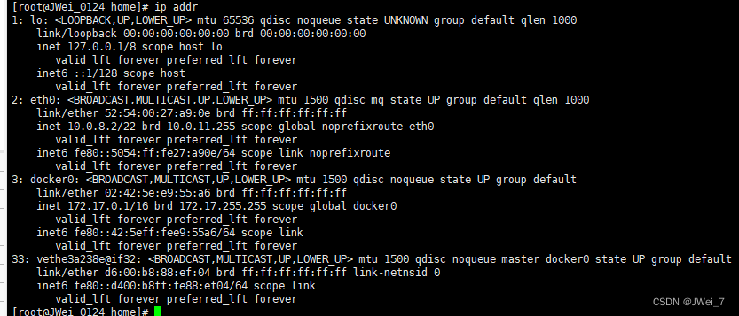

在启动一个容器测试 发现又多了一对网卡

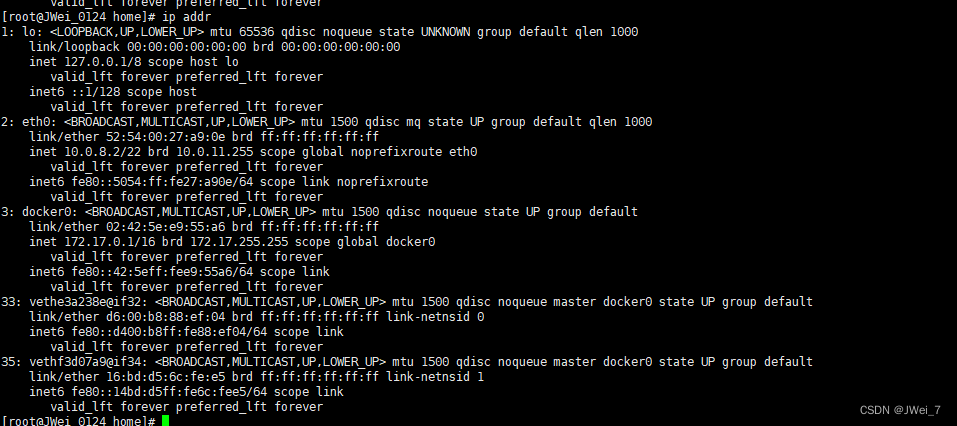

> 所以 我们可以发现 容器带来的网卡 都是一对一对的
> 
> `veth-pair 就是一对的虚拟设备接口，他们都是成对出现的，一端连着协议，一端彼此相连。` 
> 
> `正因为有这个特性，evth-pair充当一个桥梁，连接各种虚拟网络设备的。` 
> 
> `openstack，Docker容器之间的连接，OVS的连接，都是使用**veth-pair**技术。` 

我们来测试下tomcat01和tomcat02是否可以ping通！（可以ping通）

```
 [root@JWei_0124~]# docker exec -it tomcat02 ping 172.17.0.2
 PING 172.17.0.2 (172.17.0.2) 56(84) bytes of data.
 64 bytes from 172.17.0.2: icmp_seq=1 ttl=64 time=0.094 ms
 64 bytes from 172.17.0.2: icmp_seq=2 ttl=64 time=0.055 ms
 # 结论：容器和容器之间是可以互相ping通的！
```

绘制一个网络模型图

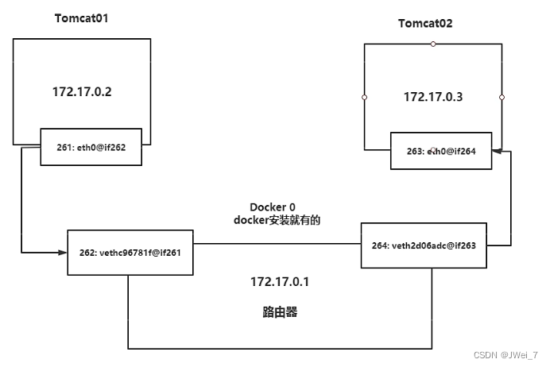

**结论：tomcat01和tomcat02是公用的一个路由器，dockero。
所有的容器不指定网络的情况下，都是docker0路由的，docker会给我们的容器分配一个默认的可用IP** 

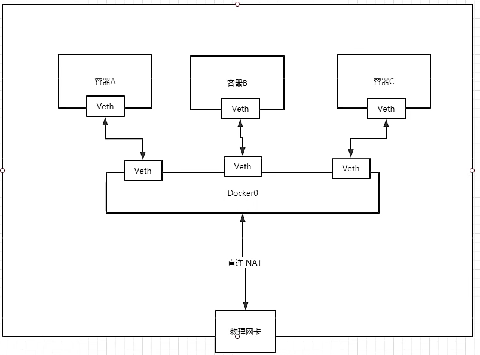

Docker中的所有的网络接口都是虚拟的。虚拟的转发效率高！（内网传递文件！）
只要容器删除，对应网桥一对就没了！

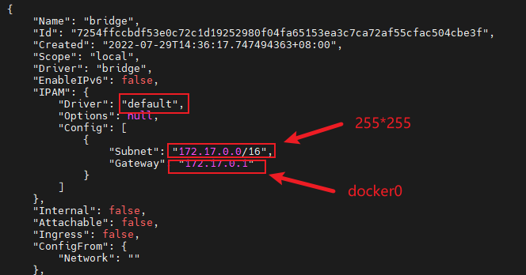

### 7\.2 link

> #### 高可用
> 
> ```
>     我们编写了一个微服务，database url=ip:，项目不重启，数据库ip换掉了，我们希望可以处理这个问题，可以名字来进行访问容器？
> ```

```
# 通过服务名ping不通；如何解决？
[root@iZbp13qr3mm4ucsjumrlgqZ ~]# docker exec -it tomcat02 ping tomcat01
ping: tomcat01: Name or service not known
# 通过--link可以解决网络连接问题。
[root@iZbp13qr3mm4ucsjumrlgqZ ~]# docker run -d -P --name tomcat03 --link tomcat02 tomcat:7.0
2393eecb870e5755068ea8b7d8bdcdd0f1ff110534c3359384413677c651bec4
[root@iZbp13qr3mm4ucsjumrlgqZ ~]# docker exec -it tomcat03 ping tomcat02
PING tomcat02 (172.17.0.3) 56(84) bytes of data.
64 bytes from tomcat02 (172.17.0.3): icmp_seq=1 ttl=64 time=0.085 ms
64 bytes from tomcat02 (172.17.0.3): icmp_seq=2 ttl=64 time=0.055 ms
# 反向可以ping通吗？（不可以）
[root@iZbp13qr3mm4ucsjumrlgqZ ~]# docker exec -it tomcat02 ping tomcat03
ping: tomcat03: Name or service not known
```

探究：docker network inspect networkID \(docker network ls可以查看networkID\)

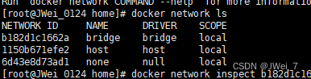

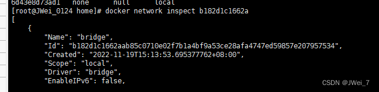

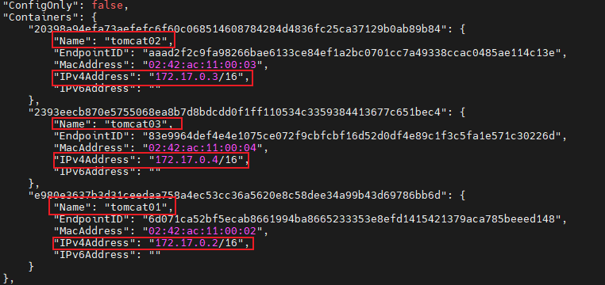

```
# 查看
[root@iZbp13qr3mm4ucsjumrlgqZ ~]# docker exec -it tomcat03 cat /etc/hosts
127.0.0.1       localhost
::1     localhost ip6-localhost ip6-loopback
fe00::0 ip6-localnet
ff00::0 ip6-mcastprefix
ff02::1 ip6-allnodes
ff02::2 ip6-allrouters
172.17.0.3      tomcat02 20398a94efa7
172.17.0.4      2393eecb870e
```

> —link 就是我们在hosts配置中增加了一个”172\.17\.0\.3 tomcat02 20398a94efa7”
> 我们现在玩Docker已经不建议使用—link了！
> 自定义网络！不适用docker0！
> docker0问题：他不支持容器名连接访问！

### 7\.3 自定义网络

#### 7\.3\.1 查看所有的docker网络

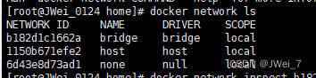

#### 7\.3\.2 网络模式

- bridge：桥接 docker（默认，自己创建也使用bridge桥接模式）

- none：不配置网络

- host：和主机共享网络

- container：容器网络连通！（用的少！局限很大）

#### 7\.3\.3 测试

```
# 我们直接启动的命令--net bridge（这个就是我们的docker0）；默认带上这个参数的，以下两种启动方式效果一致。
docker run -d -P --name tomcat01 tomcat
docker run -d -P --name tomcato1 --het bridge tomcat
# docker0特点：默认，域名不能访问，--1ink可以打通连接！
# 我们可以自定义一个网络！
[root@iZbp13qr3mm4ucsjumrlgqZ ~]# docker network create --driver bridge --subnet 192.168.0.0/16 --gateway 192.168.0.1 mynet
[root@iZbp13qr3mm4ucsjumrlgqZ ~]# docker network ls
NETWORK ID     NAME      DRIVER    SCOPE
7254ffccbdf5   bridge    bridge    local
45610891738f   host      host      local
266acd66473c   mynet     bridge    local
7795cbc2686c   none      null      local
```

我们自己的网络就创建好了

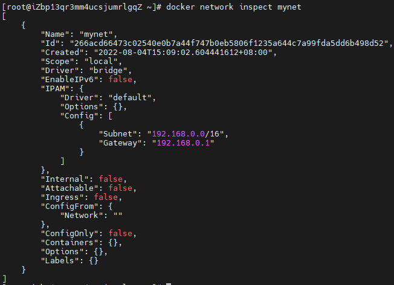

启动两个容器测试：

```

[root@JWei_0124 ~]# docker run -d -P --name tomcat-net-01 --net mynet tomcat:7.0
[root@JWei_0124~]# docker run -d -P --name tomcat-net-02 --net mynet tomcat:7.0
```

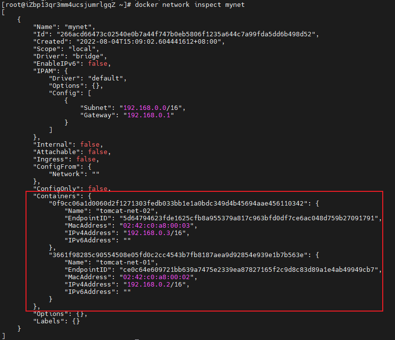

```
# 不使用--link，ping名字也可以ping通。tomcat-net-01 ping tomcat-net-02可以ping通
[root@JWei_0124~]# docker exec -it tomcat-net-01 ping tomcat-net-02
PING tomcat-net-02 (192.168.0.3) 56(84) bytes of data.
64 bytes from tomcat-net-02.mynet (192.168.0.3): icmp_seq=1 ttl=64 time=0.067 ms
64 bytes from tomcat-net-02.mynet (192.168.0.3): icmp_seq=2 ttl=64 time=0.056 ms
# 不使用--link，ping名字也可以ping通。tomcat-net-02 ping tomcat-net-01可以ping通
[root@JWei_0124~]# docker exec -it tomcat-net-02 ping tomcat-net-01
PING tomcat-net-01 (192.168.0.2) 56(84) bytes of data.
64 bytes from tomcat-net-01.mynet (192.168.0.2): icmp_seq=1 ttl=64 time=0.050 ms
64 bytes from tomcat-net-01.mynet (192.168.0.2): icmp_seq=2 ttl=64 time=0.056 ms
```

我们自定义的网络docker都已经帮我们维护好了对应的关系， **推荐我们平时这样使用网络** ！

好处：
redis \-不同的集群使用不同的网络，保证集群是安全和健康的
mysql \-不同的集群使用不同的网络，保证集群是安全和健康的

### 7\.4 网络连通

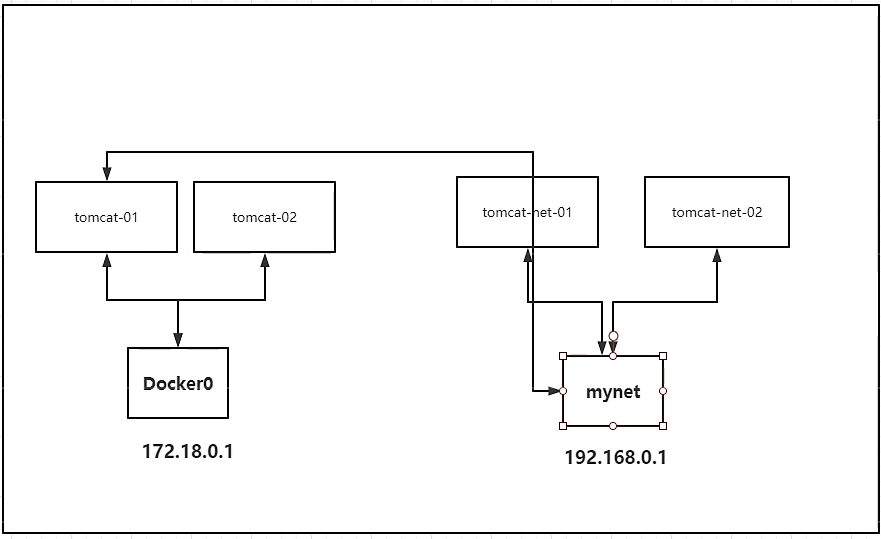

```
# tomcat01在docker0网络下，tomcat-net-01在mynet网络下；
# tomcat01 ping tomcat-net-01是ping不通的
[root@iZbp13qr3mm4ucsjumrlgqZ ~]# docker exec -it tomcat01 ping tomcat-net-01
ping: tomcat-net-01: Name or service not known
```

连接网段

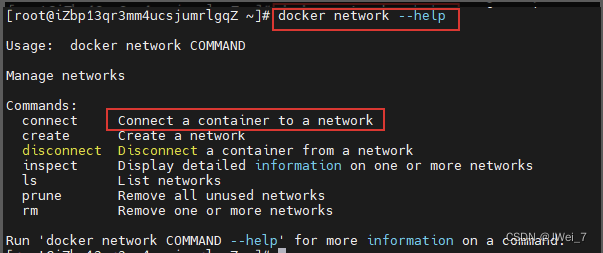

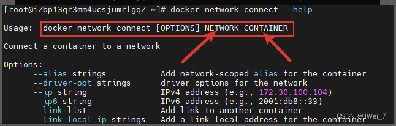

```
# 测试：打通tomcat01连接mynet
docker network connect mynet tomcat01
# 连通之后就是将tomcat01放到了mynet网络下
# 一个容器两个ip地址！I
# 阿里云服务：公网ip和私网ip
```

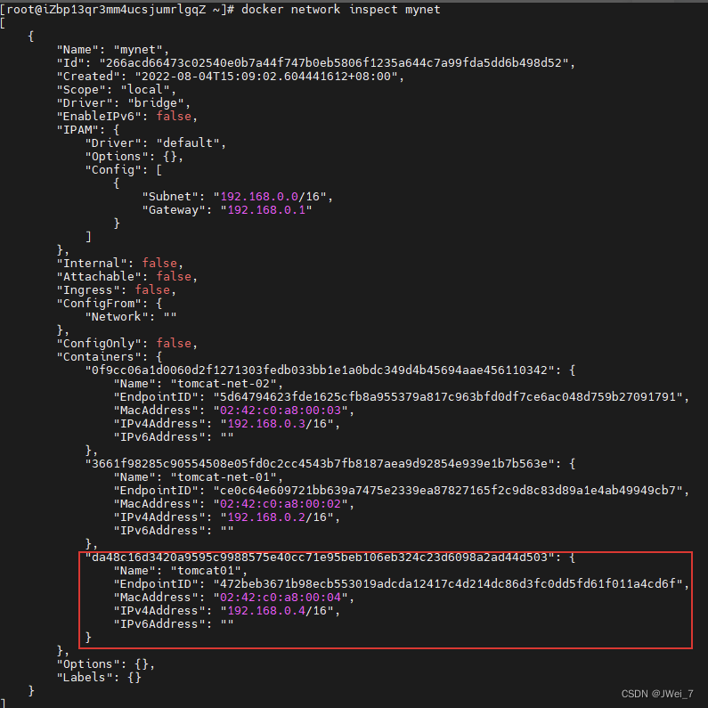

```
# 连接ok
[root@iZbp13qr3mm4ucsjumrlgqZ ~]# docker exec -it tomcat01 ping tomcat-net-01
PING tomcat-net-01 (192.168.0.2) 56(84) bytes of data.
64 bytes from tomcat-net-01.mynet (192.168.0.2): icmp_seq=1 ttl=64 time=0.065 ms
64 bytes from tomcat-net-01.mynet (192.168.0.2): icmp_seq=2 ttl=64 time=0.052 ms
```

假设要跨网络操作，就需要使用docker network connect连通！。。。。

```
[](https://blog.csdn.net/leah126/article/details/131410570?spm=1001.2014.3001.5502)[](https://blog.csdn.net/Python_0011/article/details/131370717?spm=1001.2014.3001.5502)**题外话**
```

====================================================================================================================================================================================================================================================================================================================================================================================================================================================================================================================================================================

**初入计算机行业的人或者** 大学计算机相关专业毕业生，很多因缺少实战经验，就业处处碰壁。下面我们来看两组数据：

- 2023届全国高校毕业生预计达到1158万人，就业形势严峻；

- 国家网络安全宣传周公布的数据显示，到2027年我国网络安全人员缺口将达327万。

一方面是每年应届毕业生就业形势严峻，一方面是网络安全人才百万缺口。

6月9日，麦可思研究2023年版就业蓝皮书（包括《2023年中国本科生就业报告》《2023年中国高职生就业报告》）正式发布。

**2022届大学毕业生月收入较高的前10个专业** 

本科计算机类、高职自动化类专业月收入较高。2022届本科计算机类、高职自动化类专业月收入分别为6863元、5339元。其中，本科计算机类专业起薪与2021届基本持平，高职自动化类月收入增长明显，2022届反超铁道运输类专业（5295元）排在第一位。

具体看专业，2022届本科月收入较高的专业是信息安全（7579元）。对比2018届，电子科学与技术、自动化等与人工智能相关的本科专业表现不俗，较五年前起薪涨幅均达到了19%。数据科学与大数据技术虽是近年新增专业但表现亮眼，已跻身2022届本科毕业生毕业半年后月收入较高专业前三。五年前唯一进入本科高薪榜前10的人文社科类专业——法语已退出前10之列。


“没有网络安全就没有国家安全”。当前，网络安全已被提升到国家战略的高度，成为影响国家安全、社会稳定至关重要的因素之一。

####  **网络安全行业特点** 

1、就业薪资非常高，涨薪快 2021年猎聘网发布网络安全行业就业薪资行业最高人均33\.77万！


2、人才缺口大，就业机会多

2019年9月18日《中华人民共和国中央人民政府》官方网站发表：我国网络空间安全人才 需求140万人，而全国各大学校每年培养的人员不到1\.5W人。猎聘网《2021年上半年网络安全报告》预测2027年网安人才需求300W，现在从事网络安全行业的从业人员只有10W人。


**行业发展空间大，岗位非常多** 

网络安全行业产业以来，随即新增加了几十个网络安全行业岗位︰网络安全专家、网络安全分析师、安全咨询师、网络安全工程师、安全架构师、安全运维工程师、渗透工程师、信息安全管理员、数据安全工程师、网络安全运营工程师、网络安全应急响应工程师、数据鉴定师、网络安全产品经理、网络安全服务工程师、网络安全培训师、网络安全审计员、威胁情报分析工程师、灾难恢复专业人员、实战攻防专业人员…

**职业增值潜力大** 

网络安全专业具有很强的技术特性，尤其是掌握工作中的核心网络架构、安全技术，在职业发展上具有不可替代的竞争优势。

随着个人能力的不断提升，所从事工作的职业价值也会随着自身经验的丰富以及项目运作的成熟，升值空间一路看涨，这也是为什么受大家欢迎的主要原因。

从某种程度来讲，在网络安全领域，跟医生职业一样，越老越吃香，因为技术愈加成熟，自然工作会受到重视，升职加薪则是水到渠成之事。


