# 【知识点总结】模拟电子技术（模电）

> 原创 于 2022-08-29 11:40:04 发布 · 10w+ 阅读 · 大模型引用 104 次 · CC 4.0 BY-SA版权 版权声明：本文为博主原创文章，遵循 CC 4.0 BY-SA 版权协议，转载请附上原文出处链接和本声明。
> 文章链接：https://blog.csdn.net/weixin_51130221/article/details/126538175

## 模拟电子技术

总结内容：
内容包括：二极管、PN结的形成及特性、三极管BJT、共射、共集电极、共基极放大电路、MOS场效应管、差分式放大电路、反馈、功率放大电路、滤波电路、RC正弦波振荡、 LC正弦波振荡器、电压比较器、非正弦波振荡电路、单相桥式整流、电容滤波电路

---

## 前言

`简介：` 

大家好，接着之前的电路原理，现在我开始总结模拟电子技术，模电自我上大学以来一直都是意难平的存在，刚开课那会上课听不懂，作业写起来费劲，现如今回顾这一路上学到的知识，我对其有了更深刻的认识。所以本着“查缺补漏，哪科忘了学哪科”的理念，我要首先面对感觉比较麻烦的模电ψ\(\*｀ー´\)ψ，以下便是我对模拟电子技术所学知识的理解与总结。
本人学艺不精，有一些知识点地方可能存在瑕疵，希望各位大佬可以多多指教。

---

`以下是本篇文章正文内容` 

## 第一章——半导体的基本知识

### 一\.基本概念

（1） **本征半导体** ——化学成分纯净的半导体。它在物理结构上呈单晶体形态。
（2） **空穴** ——共价键中的空位。
（3） **电子空穴对** ——由热激发而产生的自由电子和空穴对。
（4） **空穴的移动** ——空穴的运动是靠相邻共价键中的价电子依次填充空穴来实现的。
（5） **N型半导体** ——掺入五价杂质元素（如磷）的半导体。
N型半导体中 **自由电子是多数载流子** ，它主要由杂质原子提供；空穴是少数载流子，由热激发形成。
（6） **P型半导体** ——掺入三价杂质元素（如硼）的半导体。
在P型半导体中 **空穴是多数载流子** ，它主要由掺杂形成；自由电子是少数载流子， 由热激发形成。
（7） **漂移运动** ——由 **电场作用** 引起的载流子的运动称为漂移运动。
（8） **扩散运动** ——由 **载流子浓度差** 引起的载流子的运动称为扩散运动。

### 二\.PN结的形成

这一段解释起来比较麻烦，我尽量用最通俗易懂的话描述该过程。
首先，我们需要知道N型半导体中自由电子是多数载流子，而在P型半导体中空穴是多数载流子。当我们将N型半导体和P型半导体结合在一起时，电 **子和空穴均需从浓度高的区域向浓度低的区域扩散，即N型半导体中的自由电子往P型半导体中跑，P型半导体中的空穴往N型半导体中跑，从而使得原交界面处形成了一个空间电荷区（PN结）** ，其中靠近N型半导体的N区带 \+ 电，靠近P型半导体的P区带 \- 电，可见形成了内电场，用于阻止载流子扩散。而内电场促使少子漂移，阻止多子扩散，最后,多子的扩散和少子的漂移达到动态平衡，形成平衡PN结。在空间电荷区，由于缺少多子，所以也称耗尽层。

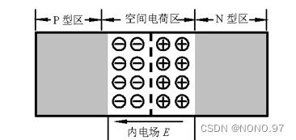

### 三\.PN结的特性

#### 1\.PN结的单向导电性

当外加电压使PN结中P区的电位高于N区的电位，称为加 **正向电压** ，简称正偏；反之称为加 **反向电压** ，简称反偏。
（1） **PN结加正向电压时** ：低电阻、大的正向扩散电流。
（2） **PN结加反向电压时** ：高电阻、很小的反向漂移电流。
由此可以得出结论：PN结具有 **单向导电性** 。

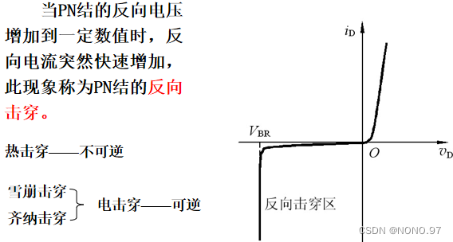

#### 2\.PN结的电容效应

**扩散电容：** 
当PN结处于正向偏置时，扩散运动使多数载流子穿过PN结，在对方区域PN结附近有高于正常情况时的电荷累积。存储电荷量的大小，取决于PN结上所加正向电压值的大小。离结越远，由于空穴与电子的复合，浓度将随之减小。
若外加正向电压有一增量△V，则相应的空穴（电子）扩散运动在结的附近产生一电荷增量△Q，二者之比△Q/△V为扩散电容Cd。

### 四\.二极管的结构和主要参数

#### 1\.二极管的结构

点接触型二极管：PN结面积小，结电容小，用于检波和变频等高频电路。
面接触型二极管：PN结面积大，用于工频大电流整流电路。

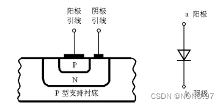

#### 2\.二极管的主要参数

最大整流电流IF、反向击穿电压Vbr、反向电流Ir、极间电容Cd、反向恢复时间。

### 五\.二极管的基本电路分析方法及其应用

二极管是一种非线性器件，因而其电路一般要采用非线性电路的分析方法。
（1） **图解分析方法** 
图解分析法较简单，但 **前提条件** 是已知二极管的 V \-I 特性曲线。找出其工作交点即可。

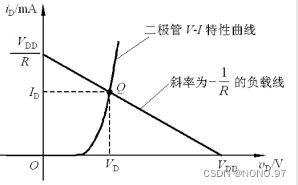

（2） **简化模型分析方法** 
**将指数模型分段线性化** ，得到二极管特性的等效模型，如采用小信号分析法等。vs =0 时, Q点称为静态工作点 ，反映直流时的工作状态。vs =Vmsinωt 时（Vm<<VDD）, 将Q点附近小范围内的 V\-I 特性线性化，得到小信号模型，即以Q点为切点的一条直线。具体方法见“ [【知识点总结】电路原理 第二讲](https://blog.csdn.net/weixin_51130221/article/details/126498382) ”
应用：整流电路、限幅电路、开关电路。

## 第二章——BJT三极管

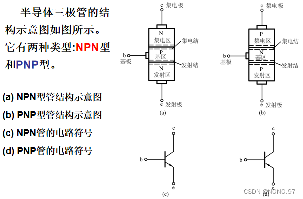

### 一\.BJT的工作原理

三极管的放大作用是在一定的外部条件控制下，通过载流子传输体现出来的。
**外部条件：发射结正偏、 集电结反偏。** 

#### 1\.内部载流子的传输过程

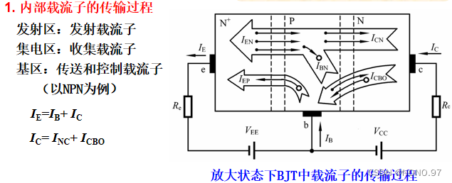

#### 2\.电流分配关系

（1）电流放大系数 α

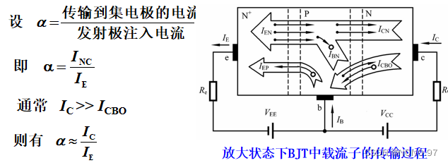

α 为电流放大系数。它只与管子的结构尺寸和掺杂浓度有关，与外加电压无关。一般 α = 0\.9~0\.99 。
（2）电流放大系数 β

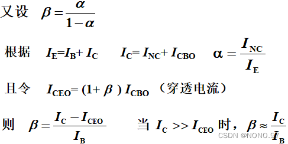

β 是另一个电流放大系数。同样，它也只与管子的结构尺寸和掺杂浓度有关，与外加电压无关。一般 β >> 1 。

#### 3\.三极管的三种组态

\(a\) 共基极接法，基极作为公共电极，用CB表示；
\(b\) 共发射极接法，发射极作为公共电极，用CE表示；
© 共集电极接法，集电极作为公共电极，用CC表示。

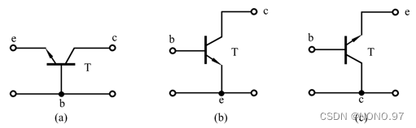

综上所述，三极管的放大作用，主要是依靠 **它的发射极电流能够通过基区传输，然后到达集电极而实现的。** 
实现这一传输过程的两个条件是：
（1） **内部条件** ：发射区杂质浓度远大于基区杂质浓度，且基区很薄。
（2） **外部条件** ：发射结正向偏置，集电结反向偏置。

#### 4\.BJT的V\-I 特性曲线

（1） **输入特性曲线** 
当vCE=0V时，相当于发射结的正向伏安特性曲线。当vCE≥1V时， vCB= vCE \- vBE>0，集电结已进入反偏状态，开始收集电子，基区复合减少，同样的vBE下 IB减小，特性曲线右移。

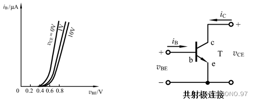

（2） **输出特性曲线** 

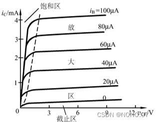

输出特性曲线的三个区域:
\*\*饱和区：\*\*iC明显受vCE控制的区域，该区域内，一般vCE＜0\.7V \(硅管\)。此时，发射结正偏，集电结正偏或反偏电压很小。
**截止区** ：iC接近零的区域，相当iB=0的曲线的下方。此时， vBE小于死区电压。
**放大区** ：iC平行于vCE轴的区域，曲线基本平行等距。此时，发射结正偏，集电结反偏。

#### 5\.BJT的主要参数

（1）电流放大系数：上边介绍过当Icbo和Iceo很小时，二者可忽略不计。
（2）极间反向电流：发射极开路时，集电结的反向饱和电流Icbo、集电极发射极间的反向饱和电流Iceo。
（3）极限参数：集电极最大允许电流Icm、集电极最大允许功率损耗Pcm、V\(BR\)CBO——发射极开路时的集电结反向击穿电压、V\(BR\) EBO——集电极开路时发射结的反向击穿电压、V\(BR\)CEO——基极开路时集电极和发射极间的击穿电压。

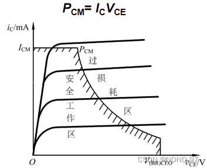

当温度上升时，BJT的反向电流ICBO、ICEO及电流放大系数都会增大，而发射结正向压降VBE会减小。这些参数随温度的变化，都会使放大电路中的集电极静态电流ICQ随温度升高而增加（ICQ= β IBQ\+ ICEO） ，从而使Q点随温度变化。 要想使ICQ基本稳定不变，就要求在温度升高时，电路能自动地适当减小基极电流IBQ 。

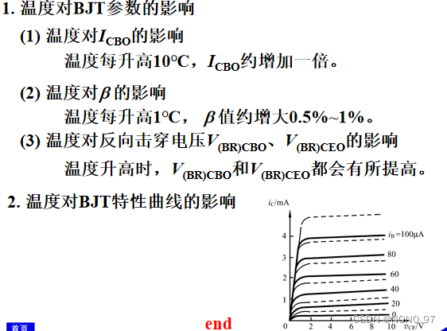

### 二\.放大电路的分析方法

#### 1\.图解分析法

**求解步骤：** 
**静态工作点的图解分析** （采用该方法分析静态工作点，必须已知三极管的输入输出特性曲线。）：
（1）首先，画出直流通路；
（2）列输入回路方程；列输出回路方程（直流负载线）；
（3）在输入特性曲线上，作出直线vbe = Vbb \- ibRb ，两线的交点即是Q点，得到IBQ；
（4）在输入特性曲线上，作出直线 Vce = Vcc \- icRc ，两线的交点即是Q点，得到IBQ。

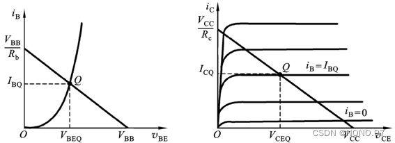

\*\*动态工作情况的图解分析：\*\*根据vs的波形，在BJT的输入特性曲线图上画出vBE 、 iB 的波形，根据iB的变化范围在输出特性曲线图上画出iC和vCE 的波形。

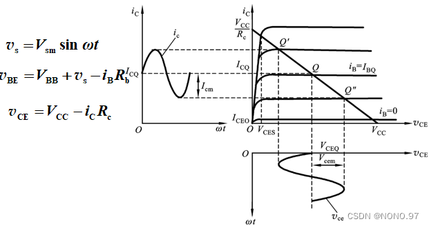

**若静态工作点选择不当，可能会导致截止失真或饱和失真。** 

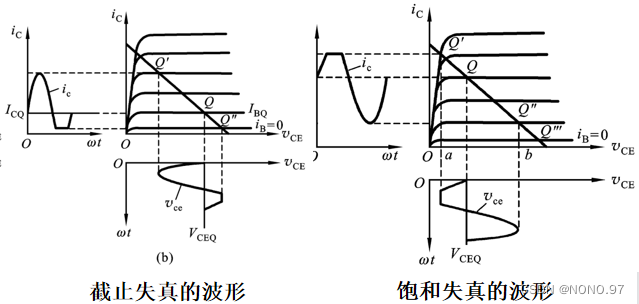

图解分析法的适用范围： **幅度较大而工作频率不太高的情况。** 
\*\*优点：\*\*直观、形象。有助于建立和理解交、直流共存，静态和动态等重要概念；有助于理解正确选择电路参数、合理设置静态工作点的重要性。能全面地分析放大电路的静态、动态工作情况。
\*\*缺点：\*\*不能分析工作频率较高时的电路工作状态，也不能用来分析放大电路的输入电阻、输出电阻等动态性能指标。

#### 2\.小信号模型分析法

**建立小信号模型的思路** ：当放大电路的输入信号电压很小时，就可以把三极管小范围内的特性曲线近似地用直线来代替，从而可以把三极管这个非线性器件所组成的电路当作线性电路来处理。详细见“ [【知识点总结】电路原理 第二讲](https://blog.csdn.net/weixin_51130221/article/details/126498382) ”

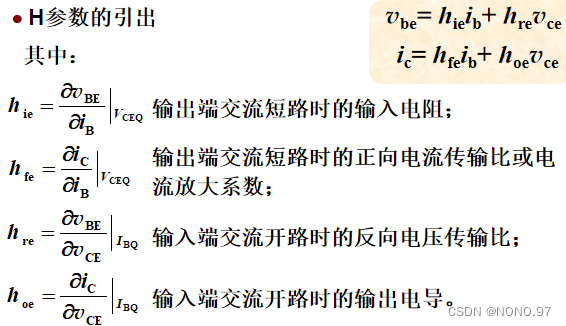

受控电流源hfeib ，反映了BJT的基极电流对集电极电流的控制作用。电流源的流向由ib的流向决定。hre vce是一个受控电压源。反映了BJT输出回路电压对输入回路的影响。

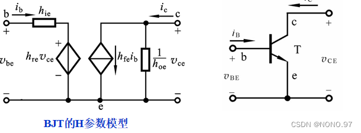

**注** ：H参数都是小信号参数，即微变参数或交流参数；H参数与工作点有关，在放大区基本不变；H参数都是微变参数，所以只适合对交流信号的分析。

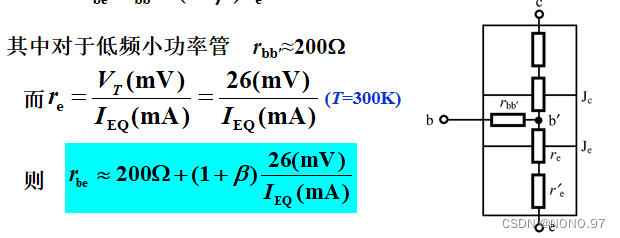

**求解步骤：** 
用H参数小信号模型分析基本共射极放大电路：
（1）利用直流通路求Q点；
（2）画小信号等效电路；
（3）求放大电路动态指标，如电压增益、输入电阻、输出电阻。
**小信号模型分析法的优缺点：** 
\*\*优点：\*\*分析放大电路的动态性能指标\(Av 、Ri和Ro等\)非常方便，且适用于频率较高时的分析。
\*\*缺点：\*\*在BJT与放大电路的小信号等效电路中，电压、电流等电量及BJT的H参数均是针对变化量\(交流量\)而言的，不能用来分析计算静态工作点。

### 三\.基本共射极放大电路、共集电极放大电路和共基极放大电路

#### 1\.基本共射极放大电路

（1） **静态\(直流工作状态\)** 

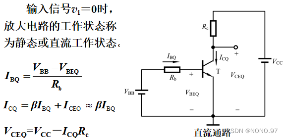

（2）\*\*动态：\*\*输入正弦信号vs后，电路将处在动态工作情况。此时，BJT各极电流及电压都将在静态值的基础上随输入信号作相应的变化。

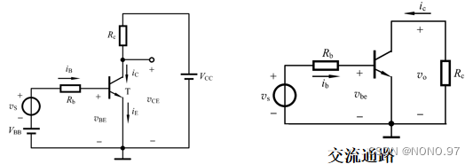

#### 2\.共集电极放大电路（射极输出器）

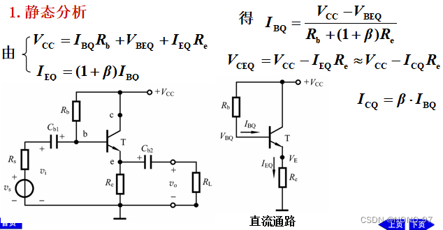

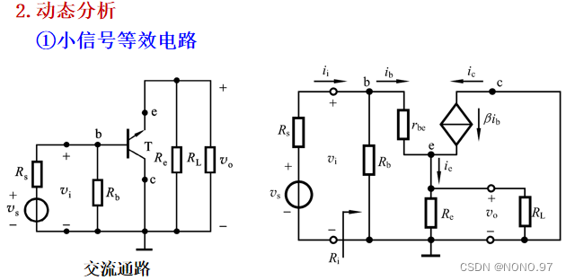

注：（以上不列举具体公式）
**共集电极电路特点** ：
（1）电压增益小于1但接近于1，vo 与vi同相。
（2）输入电阻大，对电压信号源衰减小。
（3）输出电阻小，带负载能力强。

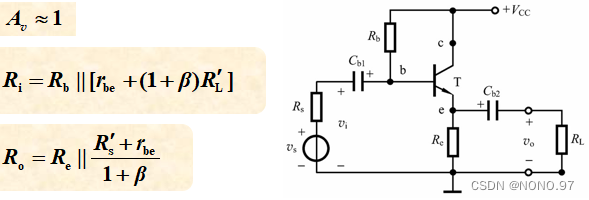

#### 3\.共基极放大电路

直流通路与射极偏置电路相同。

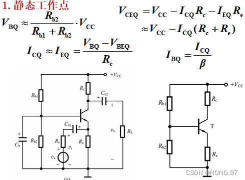

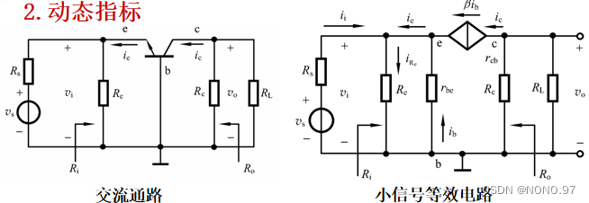

#### 4\.三种组态的判别

以输入、输出信号的位置为判断依据：
信号由基极输入，集电极输出—— **共射极放大电路** 
信号由基极输入，发射极输出—— **共集电极放大电路** 
信号由发射极输入，集电极输出—— **共基极电路** 

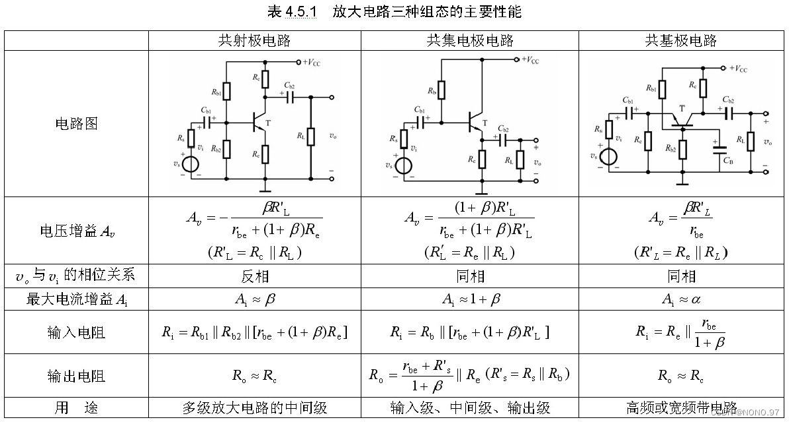

三种组态的 **特点及用途** ：
**共射极放大电路：** 
电压和电流增益都大于1，输入电阻在三种组态中居中，输出电阻与集电极电阻有很大关系。适用于低频情况下，作多级放大电路的中间级。
**共集电极放大电路：** 
只有电流放大作用，没有电压放大，有电压跟随作用。在三种组态中，输入电阻最高，输出电阻最小，频率特性好。可用于输入级、输出级或缓冲级。
**共基极放大电路：** 
只有电压放大作用，没有电流放大，有电流跟随作用，输入电阻小，输出电阻与集电极电阻有关。高频特性较好，常用于高频或宽频带低输入阻抗的场合，模拟集成电路中亦兼有电位移动的功能。

### 四\.射极偏置电路

**基极分压式射极偏置电路** 

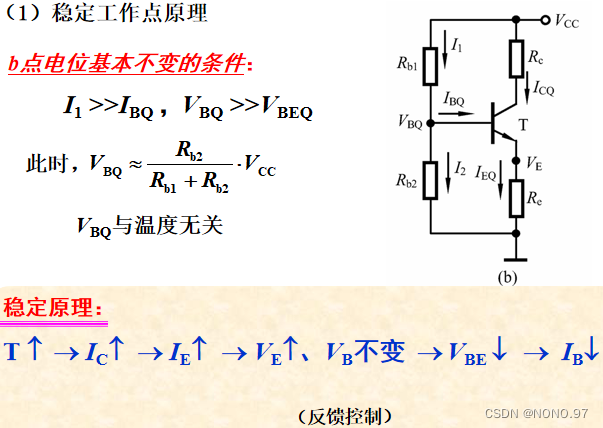

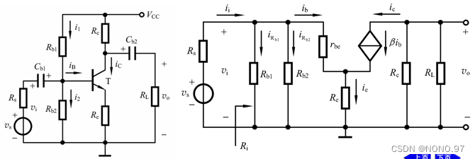

***注：（以上不列举具体公式）*** 
除此之外，还有含有 **双电源的射极偏置电路、含有恒流源的射极偏置电路** 

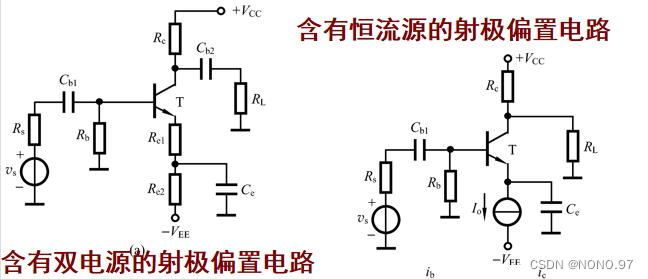

### 五\.组合放大电路

组合放大电路总的电压增益等于组成它的各级单管放大电路 **电压增益的乘积** 。前一级的输出电压是后一级的输入电压，后一级的输入电阻是前一级的负载电阻RL。

## 第三章——MOS场效应管

### 一\.场效应管的分类：

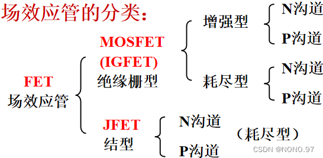

\*\*耗尽型：\*\*场效应管没有加偏置电压时，就有导电沟道存在。
\*\*增强型：\*\*场效应管没有加偏置电压时，没有导电沟道。

#### 1\.N沟道增强型MOSFET

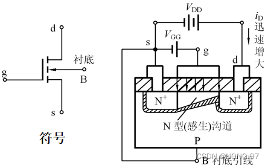

**工作原理：** 
（1）vGS对沟道的控制作用：
当vGS≤0时：无导电沟道，d、s间加电压时，也无电流产生。
当0<vGS <VT 时：产生电场，但未形成导电沟道（感生沟道），d、s间加电压后，没有电流产生。
当vGS≥VT 时：在电场作用下产生导电沟道，d、s间加电压后，将有电流产生。
vGS越大，导电沟道越厚，其中VT 称为开启电压。
（2）vDS对沟道的控制作用：当vGS一定（vGS >VT ）时，vDS变大↑ → 使iD变大↑ → 从而使沟道电位梯度升高 → 靠近漏极d处的电位升高 → 电场强度减小 → 沟道变薄，整个沟道呈楔形分布。当vDS增加到使vGD=VT 时，在紧靠漏极处出现预夹断。在预夹断处：vGD = vGS \- vDS = VT，预夹断后，vDS↑ → 夹断区延长 → 沟道电阻↑ → iD基本不变。

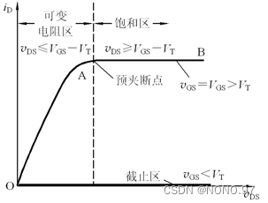

\*\*☆☆注：\*\*若vDS和vGS同时作用时，假设vDS一定，vGS变化时，给定一个vGS ，就有一条不同的 iD – vDS 曲线。

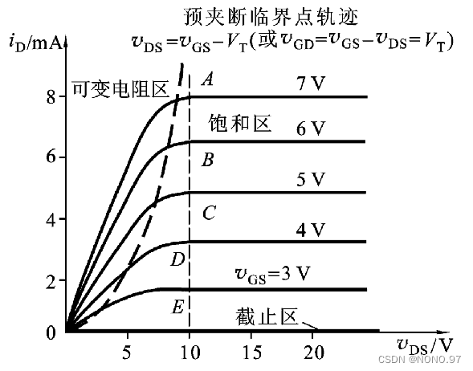

\*\*① 截止区：\*\*当vGS＜VT时，导电沟道尚未形成，iD＝0，为截止工作状态。
**② 可变电阻区** ：vDS≤（vGS－VT）时，rdso是一个受vGS控制的可变电阻。
**③ 饱和区** ：vGS >VT ，且vDS≥（vGS－VT）

#### 2\.N沟道耗尽型MOSFET

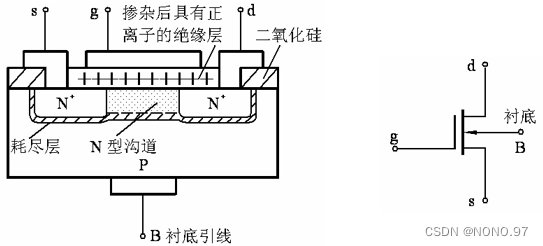

二氧化硅绝缘层中掺有大量的正离子，可以在正或负的栅源电压下工作，而且基本上无栅流。

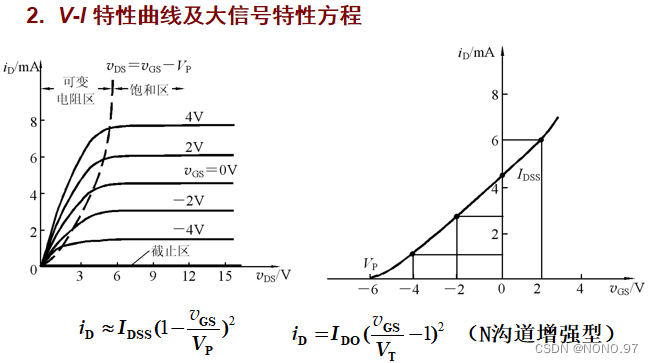

#### 3\.P沟道MOSFET

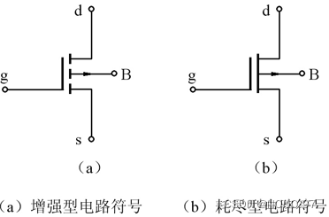

### 二\.MOSFET的主要参数

**直流参数：** 
（1）开启电压VT （增强型参数）
（2）夹断电压VP （耗尽型参数）
（3）饱和漏电流IDSS （耗尽型参数）
（4）直流输入电阻RGS （109Ω～1015Ω ）
\*\*交流参数：\*\*输出电阻rds、低频互导gm
\*\*极限参数：\*\*最大漏极电流IDM、最大耗散功率PDM、最大漏源电压V（BR）DS、最大栅源电压V（BR）GS

### 三\.MOSFET放大电路的分析与计算

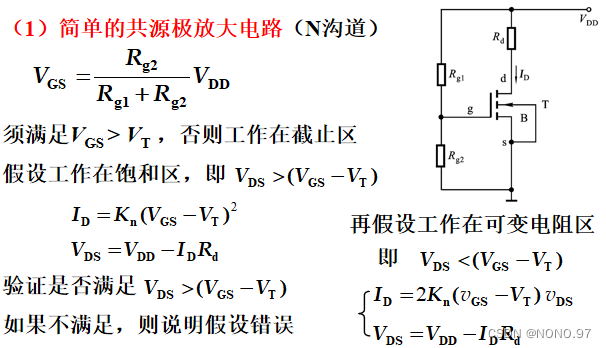

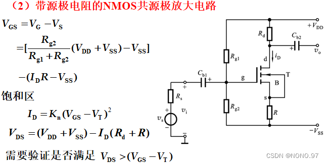

**计算步骤：** 
（1）直流偏置及静态工作点的计算
（2）图解分析
（3）小信号模型分析

### 四\.各种放大器件电路性能比较

mos 管利用栅源之间的电压 vgs 控制漏极电流，BJT利用基射极间的电压 vbe 控制集电极的电流 ic。但在放大区，mos管的 id 与 vgs 之间是平方律关系，而 BJT 的 ic 与 vbe 之间是指数关系，显然，指数关系更为敏感。故称 **mos 管为电压控制器件，BJT 为电流控制器件。** 

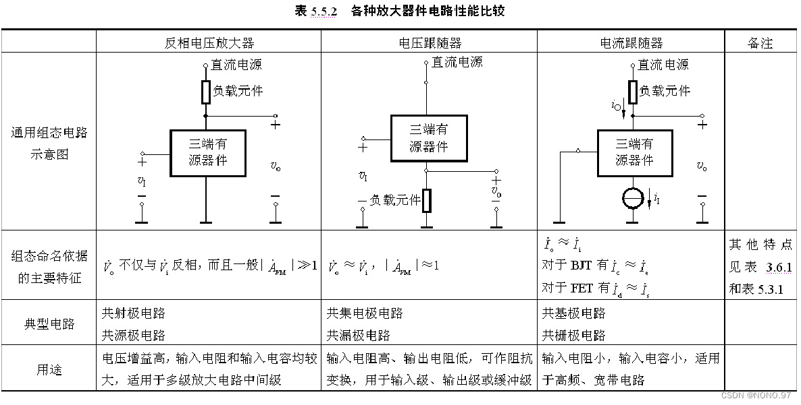

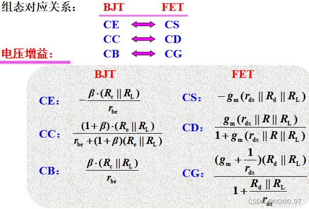

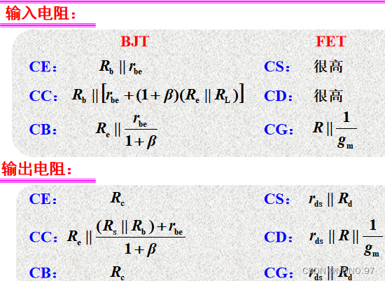

## 第四章——模拟集成电路

### 一\.电流源

电流源可分为 **BJT 电流源电路和 FET 电流源** 
（1） **BJT 电流源电路** 

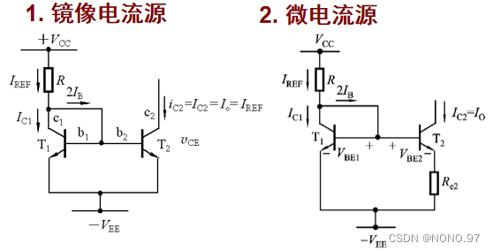

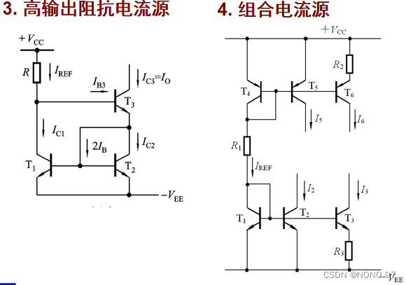

在4中，T1、R1 和T4支路产生基准电流IREF，T1和T2、T4和T5构成镜像电流源，T1和T3，T4和T6构成了微电流源。
（2） **FET 电流源** 

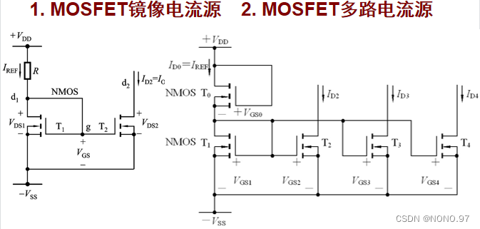

### 二\.差分式放大电路

#### 1\.结构及相关概念

（1）差模信号：vid = vi1 \- vi2，差模信号相当于两个输入端信号中不同的部分
（2）共模信号：vic = 0\.5 \* （vi1 \+ vi2），共模信号相当于两个输入端信号中相同的部分
（3）差模电压增益：Avd = vo’ / vid
（4）共模电压增益：Avc = vo” / vic
（5）共模抑制比：Kcmr = Avd / Avc ，其反映抑制零漂能力
vo’ ——差模信号产生的输出， vo” ——共模信号产生的输出，两输入端中的共模信号大小相等，相位相同；差模信号大小相等，相位相反。

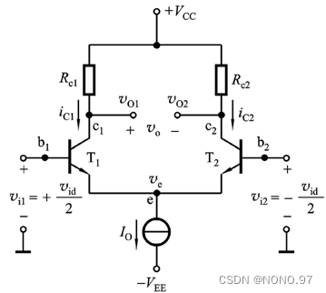

#### 2\.射极耦合差分式放大电路

（1） **工作原理** ：

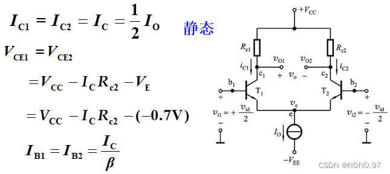

动态时，当输入共模信号，共模信号的输入使两管集电极电压有相同的变化，voc = vo1 \- vo2 = 0，共模增益Avc = 0。当输入差模信号，vi1 和 vi2 大小相等，相位相反。vo1 和 vo2 大小相等，相位相反。vo = vo1 \- vo2 ≠ 0，信号被放大。
（2）\*\*抑制零点漂移原理：\*\*当温度变化和电源电压波动，都将使集电极电流产生变化。且变化趋势是相同的，其效果相当于在两个输入端加入了共模信号，以双倍的元器件换取抑制零漂的能力。

#### 3\.差分式放大电路的传输特性曲线

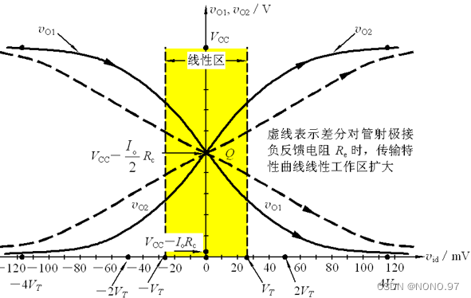

### 三\.集成电路运算放大器

#### 1\.实际集成运放的主要参数

**输入直流误差特性（输入失调特性）：** 
（1）输入失调电压VIO：在室温（25℃）及标准电源电压下，输入电压为零时，为了使集成运放的输出电压为零，在输入端加的补偿电压叫做失调电压VIO。
（2）输入偏置电流IIB：输入偏置电流是指集成运放两个输入端静态电流的平均值。
（3）输入失调电流IIO：输入失调电流IIO是指当输入电压为零时流入放大器两输入端的静态基极电流之差。
（4）温度漂移：分为输入失调电压温漂、输入失调电流温漂。
**差模特性：** 
（1）开环差模电压增益Avo
（2）开环带宽BW \(fH\)
（3）单位增益带宽 BWG \(fT\)
（4）差模输入电阻rid和输出电阻ro
（5）最大差模输入电压Vidmax
**共模特性：** 
（1）共模抑制比KCMR和共模输入电阻ric
（2）最大共模输入电压Vicmax
\*\*大信号动态特性：\*\*转换速率SR、全功率带宽BWP
\*\*电源特性：\*\*电源电压抑制比KSVR、静态功耗PV

### 四\.集成运放应用中的实际问题

#### 1\.失调电压VIO、失调电流IIO和偏置电流IIB带来的误差

其\*\*特点：\*\*时间越长，误差越大，且易使输出进入饱和状态。 **解决方案** ——调零补偿

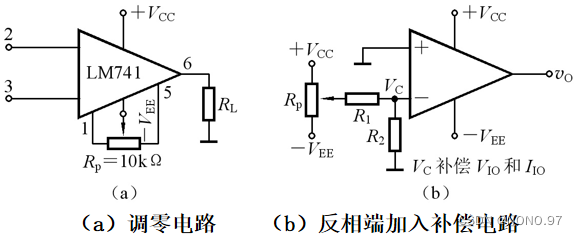

#### 2\.放大电路中的噪声与干扰

（1） **噪声的种类及性质:** 
**电阻的热噪声** ——由电子无规则热运动而产生随时间而变化的电压称为热噪声电压。其本身是一个非周期变化的时间函数，它的频率范围是很宽广的。因而噪声电压Vn将随放大电路带宽的增加而增加。所以在设计放大电路时要综合考虑增益、带宽等诸多因素。
**三极管的噪声** ——分为热噪声、散粒噪声、闪砾噪声。

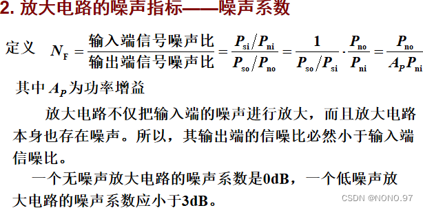

（2）\*\*减小噪声的措施：\*\*选低噪声集成运放，如OP\-27，AD745等；采用滤波处理或引入负反馈以抑制噪声；转换为数字信号后，借助软件方法，对数据进行处理以减小噪声的影响。
（3） **放大电路中的干扰：** 
**①杂散电磁场干扰** ——电路工作环境一般有许多电磁干扰源，常见的有工频干扰、无线电台及雷电现象等，它们所产生电磁波或尖峰脉冲，通过接线电容耦合、电感耦合或交流电源线等进入放大电路，从而引入干扰电压。
\*\*抑制措施： **合理布局、屏蔽
②由直流电源电压波动引起的干扰——直流电源输出的50Hz或100Hz的纹波电压使电路的电流产生波动而形成干扰电压。第一级的波动将被后续各级放大而使输出端产生较大的干扰电压。** 
抑制措施：\*\*采用性能好的稳压电源供电，并在稳压电路的输入端和输出端分别加一足够大的电解电容或钽电容的滤波电路。对于运算放大器，可在电源引脚和地端间加一钽电容（10μF～30μF）防止低频干扰，加一独石电容（0\.01μF～0\.1μF）防止高频干扰。
**③由交流电源串入的干扰和抑制、由接地点安排不正确而引起的干扰和正确接地。** 

## 第五章——反馈放大电路

### 一\.反馈的基本概念与分类

关于开环、闭环的概念在 [【知识点总结】电路原理 第一讲](https://blog.csdn.net/weixin_51130221/article/details/125953063) 有所涉及，在此不重复说明。

#### 1\.直流反馈与交流反馈

根据反馈到输入端的信号是交流，还是直流，或同时存在，来进行判别。

#### 2\.正反馈与负反馈

**净输入量可以是电压，也可以是电流。** 
从输出端看
正反馈：输入量不变时，引入反馈后输出量变大了。
负反馈：输入量不变时，引入反馈后输出量变小了。
从输入端看
正反馈：引入反馈后，使净输入量变大了。
负反馈：引入反馈后，使净输入量变小了。
\*\*判别方法：\*\*瞬时极性法。即在电路中，从输入端开始，沿着 信号流向，标出某一时刻有关节点电压变化的斜率（正斜率或负斜率，用“\+”、“\-”号表示）。

#### 3\.串联反馈与并联反馈

#### 4\.电压反馈与电流反馈

电压反馈与电流反馈由反馈网络在放大电路输出端的取样对象决定。
\*\*电压反馈：\*\*反馈信号xf和输出电压成比例，即 xf = Fvo，电压负反馈稳定输出电压。
\*\*电流反馈：\*\*反馈信号xf与输出电流成比例，即 xf = Fio ，电流负反馈稳定输出电流。
**判断方法：负载短路法** ——将负载短路（未接负载时输出对地短路），反馈量为零——电压反馈；若反馈量仍然存在——电流反馈。

### 二\.负反馈放大电路的四种组态

#### 1\.四种组态

（1） **电压串联负反馈放大电路** 

（2） **电压并联负反馈放大电路** 

（3） **电流串联负反馈放大电路** 

（4） **电流并联负反馈放大电路** 

#### 2\.四种组态特点小结

（1） **串联反馈** ：输入端电压求和（KVL）
（2） **并联反馈** ：输入端电流求和（KCL）
（3） **电压负反馈** ：稳定输出电压，具有恒压特性
（4） **电流负反馈** ：稳定输出电流，具有恒流特性

#### 3\.信号源对反馈效果的影响

### 三\.负反馈放大电路增益的一般表达式

\*\*反馈深度讨论：\*\*一般情况下，A和F都是频率的函数，其中（1 \+ AF）为反馈深度，当（1 \+ AF） > 1 时为一般负反馈；若当（1 \+ AF） >> 1 时为深度负反馈；若当（1 \+ AF） < 1 时为正反馈；当（1 \+ AF） =0 时为自激振荡。

### 四\.负反馈对放大电路性能的影响

**（1）提高增益的稳定性** ——闭环增益相对变化量是开环时的1 / （1 \+ AF）倍。闭环增益只取决于反馈网络。当反馈网络由稳定的线性元件组成时，闭环增益将有很高的稳定性。此次之外，负反馈的组态不同，稳定的增益不同。
**（2）减小非线性失真** ——闭环时增益减小，线性度变好。不过其只能减少环内放大电路产生的失真，如果输入波形本身就是失真的，即使引入负反馈，也无济于事。

**（3）抑制反馈环内噪声** 
**（4）展宽放大电路的通频带** 

**（5）对输入电阻和输出电阻的影响：** 

**负反馈对放大电路性能的改善，是以牺牲增益为代价的，且仅对环内的性能产生影响。** 
**注意:** 反馈对输入电阻的影响仅限于环内，对环外不产生影响。

### 五\.设计负反馈放大电路的一般步骤

（1） **选定需要的反馈类型** ——信号源性质、对输出信号的要求、对输入、输出电阻的要求、对信号变换的要求（V\-V、V\-I、I\-V、I\-I ）。
（2） **确定反馈系数的大小** 。
（3） **适当选择反馈网络中的电阻阻值** ——尽量减小反馈网络对基本放大电路的负载效应。
（4） **通过仿真分析，检验设计是否满足要求。** 

### 六\.负反馈放大电路的稳定性（自激振荡及稳定工作的条件）

自激振荡 **现象** ：在不加任何输入信号的情况下，放大电路仍会产生一定频率的信号输出。

#### 1\.产生原因及条件

\*\*产生原因：\*\*A 和 F 在高频区或低频区产生的附加相移达到180，使中频区的负反馈在高频区或低频区变成了正反馈，当满足了一定的幅值条件时，便产生自激振荡。

#### 2\.稳定工作条件

#### 3\.负反馈放大电路稳定性分析

## 第六章——功率放大电路

**功率放大电路** 是一种以输出较大功率为目的的放大电路。因此，要求同时输出较大的电压和电流。管子工作在接近极限状态， **一般用于直接驱动负载，带载能力要强。** 
根据 **正弦信号整个周期内三极管的导通情况** 划分：
（1） **甲类** ：一个周期内均导通
（2） **乙类** ：导通角等于180°
（3） **甲乙类** ：导通角大于180°
（4） **丙类** ：导通角小于180°

### 一\.甲类功放

\*\*特点：\*\*电压增益近似为1，电流增益很大，可获得较大的功率增益，输出电阻小，带负载能力强。，但其效率低。

### 二\.乙类功放——双电源互补对称功率放大电路（效率高）

#### 1\.电路组成

由一对 NPN、PNP 特性相同的互补三极管组成，采用正、负双电源供电。这种电路也称为OCL互补功率放大电路。

#### 2\.工作原理

两个三极管在信号正、负半周轮流导通，使负载得到一个完整的波形。

### 三\.甲乙类功放——互补对称功率放大电路

**乙类互补对称电路存在的问题** ——可能会出现交越失真。

甲乙类互补对称功率放大电路的结构与工作原理：

## 第七章——信号处理与信号产生电路

**基本概念** 
（1） **滤波器** ——是一种能使有用频率信号通过而同时抑制或衰减无用频率信号的电子装置。
（2） **有源滤波器** ——由有源器件构成的滤波器。

### 一\.有源滤波电路

（1）二阶有源低通滤波电路

（2）二阶有源低通滤波电路

（3）有源带通滤波电路
工作原理：低通与高通相串联即可得到带通滤波电路，相当于“与”的关系。

（4）二阶有源带阻滤波电路
工作原理：低通与高通相并联即可得到带阻滤波电路，相当于“或”的关系。

### 二\.正弦波振荡电路

**基本组成：放大电路（包括负反馈放大电路）、反馈网络（构成正反馈的）、选频网络（选择满足相位平衡条件的一个频率。经常与反馈网络合二为一）、稳幅环节。
振荡条件：

振荡电路是单口网络，无需输入信号就能起振，起振的信号源来自电路器件内部噪声以及电源接通扰动** 噪声中，满足相位平衡条件的某一频率0的噪声信号被放大，成为振荡电路的输出信号。当输出信号幅值增加到一定程度时，就要限制它继续增加，否则波形将出现失真。 **稳幅的作用** 就是，当输出信号幅值增加到一定程度时，使振幅平衡条件从 AF > 1 回到 AF = 1。

### 三\.RC正弦波振荡电路

**振荡电路工作原理：** 

反馈网络兼做选频网络。
\*\*稳幅措施：\*\*可采用热敏元件、场效应管（JFET）、二极管进行稳幅。

### 四\.LC正弦波振荡电路

（1）变压器反馈式LC振荡电路:

三点式LC振荡电路：可分为三点式LC并联电路、电感三点式振荡电路、电容三点式振荡电路。
（2）\*\*石英晶体振荡电路：\*\*将石英放置在极板间，并加以电场，晶体机械变形。若在极板间加机械力，晶体将产生电场，这就是压电效应。交变电压 → 机械振动 → 交变电压。其机械振动的固有频率与晶片尺寸有关，稳定性高，当交变电压频率 = 固有频率时，振幅最大，即压电谐振。

### 五\.电压比较器

#### 1\.单门限电压比较器

\*\*特点：\*\*开环，虚短不成立，增益A0大于105，\- VCC ≤ vO ≤ \+ VCC。运算放大器工作在非线性状态下。
（1） **过零比较器** 

若输入为正负对称的正弦波时，输出为方波。
（2） **门限电压不为零的比较器** 

#### 2\.迟滞比较器

\*\*工作原理：\*\*设 vp 为门限电压，对该电路计算可得上述式子（可将 VT 看为 vp ）。若反向输入端电压 vI > vp ，则输出 vo 为低电平，若反向输入端电压 vI < vp ，则输出 vo 为高电平。
**除此之外，应注意“迟滞”的含义** ，在上门限电压与下门限电压之间存在着迟滞区域。若反向输入端电压一开始 vI < vp ，而后不断增大 vI 的值，只有当其高于上门限电压时，即 vI > vp时电平翻转成低电平。同理，若反向输入端电压一开始 vI > vp ，而后不断减小 vI 的值，只有当其低于下门限电压时，即 vI < vp 时，电平翻转成高电平。
\*\*☆☆☆注意：\*\*此时不是负反馈，故不能用虚短虚断的结论。

#### 3\.小结

通过上述几种电压比较器的分析，可得出如下结论：
（1）用于电压比较器的运放，通常工作在开环或正反馈状态和非线性区，其输出电压只有高电平VOH和低电平VOL两种情况。
（2）一般用电压传输特性来描述输出电压与输入电压的函数关系。
（3）电压传输特性的关键要素：输出电压的高电平VOH和低电平VOL、门限电压、输出电压的跳变方向。
令vP＝vN所求出的vI就是门限电压。vI等于门限电压时输出电压发生跳变。跳变方向取决于是同相输入方式还是反相输入方式。

### 六\.非正弦波振荡电路

#### 1\.方波产生电路（多谐振荡电路）

该方案利用了 **电容充放电** 的原理，当反向输入端的 vc 小于同相输入端的电压时，输出 vo 为高电平VOH，同时其沿着Rf给电容充电，使反向输入端的 vc 电位升高，而当反向输入端的 vc 大于同相输入端的电压时，输出 vo 为低电平VOL，同时电容沿着Rf进行放电，使反向输入端的 vc 电位下降，当反向输入端的 vc 小于同相输入端的电压时，重新开始循环，如此反复，便可在电压输出端得到方波。 **稳压管的作用是双向限幅，对电压进行限位。** 
占空比可变的方波产生电路：原理是 **增设了二极管、 Rf1 和 Rf2** 来改变 **充放电时间** 从而改变占空比。

#### 2\.锯齿波产生电路

其由 **同相输入迟滞比较器、积分电路** 等组成，由迟滞比较器，产生方波，利用积分电路，对其进行积分，产生的信号作为电压比较器同相端电压的输入。其中 **双向稳压管的作用是双向限幅，对电压进行限位。** 

## 第八章——直流稳压电源

### 一\.单相桥式整流电路

**工作原理：利用二极管的单向导电性** 

若通过变压器输出的 v2 在正半周期，D1、D3导通，在负半周期，D2、D4导通，平均下来其负载端电压电流就为正向电压电流，实现整流（交流→直流）。
参数计算：

### 二\.滤波电路

电容滤波

电容具有储能滤波的功能，可对波动信号进行 **消抖和滤波** ，并具有以下 **特点** ：
（1）二极管的导电角 θ < π ，流过二极管的瞬时电流很大。
（2）负载直流平均电压 VL 升高， τd = RC越大，VL越高。
（3）直流电压 VL 随负载电流增加而减少。

电感滤波

### 三\.串联反馈式稳压电路

工作原理：

除此之外还有三端集成稳压器，如正电压 78XX 、负电压 79XX等

## 总结

`小小的总结：` 

又完成一门，历时近一周终于完成了，由于知识有些久远，无法找到我之前记录的笔记\(ಥ\_ಥ\) ，所以总结起来费了不少力气，不过感觉累并快乐着，不断回顾总结，让我对知识的理解有所加深。下一次我将更新数字电路，接着就是自动控制原理、MATLAB、电力电子技术等，感谢大家的支持！
***注：里边的内容、见解有些小问题，希望各位大佬可以多多指教。*** 

## 学习资料附件：

链接：https://pan\.baidu\.com/s/1Ha9CycY0eetdytLkgyPA5w
提取码：4doj